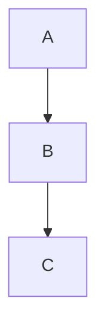

# Ebook Writer

A simple, Pandoc/Markdown/Mermaid-based ebook writer for creating beautifully laid out English books (afrinenglish.com) and coding ebooks (backendchallenges.com).

## Features

- Write books in Markdown
- Render to beautiful HTML with custom templates
- Mermaid diagram support (with live rendering via pandoc-mermaid-filter)
- Scalable system supporting many books of varying sizes (10-120+ pages)
- Configuration-based book management
- Multiple template support

## Project Structure

- `books/` — Markdown source files and book configuration
- `templates/` — Custom HTML/CSS templates for different book types
- `public/` — Output HTML files
- `scripts/` — Automation scripts for book and template management
- `requirements.txt` — Python dependencies for filters

## Quick Start

### Prerequisites

- [Pandoc](https://pandoc.org/installing.html) - for Markdown to HTML conversion
- [jq](https://jqlang.github.io/jq/download/) - for JSON configuration parsing
- [Python 3](https://www.python.org/downloads/) - for filters

### Python Virtual Environment Setup

1. Create a virtual environment:
   ```bash
   python3 -m venv .venv
   ```
2. Activate the virtual environment:
   ```bash
   source .venv/bin/activate
   ```
3. Upgrade pip (optional):
   ```bash
   pip install --upgrade pip
   ```
4. Install requirements:
   ```bash
   pip install -r requirements.txt
   ```

### List Available Books and Templates

```bash
./scripts/list-books.sh
```

### Create a New Book

```bash
./scripts/new-book.sh <book-name> <template> [title] [author]
```

Example:

```bash
./scripts/new-book.sh my-english-book afrinenglish "My English Book" "John Doe"
```

### Create a New Template

```bash
./scripts/new-template.sh <template-name> <template-title> <description>
```

Example:

```bash
./scripts/new-template.sh modern "Modern Template" "Clean and modern design"
```

### Build Books

```bash
# Build all books
./scripts/build-html.sh

# Build specific book
./scripts/build-html.sh <book-name>
```

## Book Configuration

Books are configured in `books/book-config.json`:

```json
{
  "books": {
    "book-name": {
      "title": "Book Title",
      "author": "Author Name",
      "template": "template-name",
      "category": "category",
      "description": "Book description"
    }
  }
}
```

## Templates

Each template consists of:

- `templates/template-name.html` - Pandoc HTML template
- `templates/template-name.css` - Custom CSS styling

### Available Templates

- **afrinenglish** - Colorful, elegant layout for English learning books
- **backendchallenges** - Intense, code-focused layout for programming books

## Writing Books

Write your books in Markdown with these features:

### Boxes

```markdown
<div class="box">

Your content in a styled box

</div>
```

### Multi-columns

```markdown
<div class="columns">

- Column 1 content
- Column 2 content

</div>
```

### Mermaid Diagrams

````markdown

````

````

### Code Blocks
```markdown
```python
def hello():
    return "Hello, World!"
````

## Roadmap

- Add more beautiful templates
- Export to PDF, EPUB, MOBI
- Web-based editor
- Template marketplace

---

## Advanced: Live Mermaid Rendering with Pandoc Filter

To enable live Mermaid diagram rendering in your HTML output:

1. **Activate your virtual environment:**
   ```bash
   source .venv/bin/activate
   ```
2. **Build with the filter:**
   ```bash
   pandoc books/afrinenglish-sample.md -o public/afrinenglish-sample.html --template=templates/afrinenglish.html --standalone --toc --highlight-style=pygments --filter pandoc-mermaid-filter
   ```
3. **Or update your build script to use the filter.**

---
