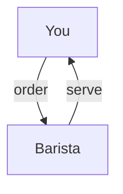
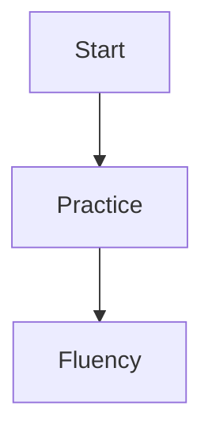

# The Joy of Learning English

> "Learning another language is like becoming another person." — Haruki Murakami

Welcome to your journey of mastering English! This book is your companion to joyful, expressive, and confident communication.

## Lesson 1: A Morning in the Park

Imagine you are walking in a beautiful park. The sun is shining, birds are singing, and you greet a friend.

**Story:**

> Anna walks into the park and sees her friend Ben. She smiles and says, "Good morning, Ben! How are you today?"

**Vocabulary:**

- greet (verb): to say hello
- smile (verb): to make a happy face
- park (noun): a place with grass and trees

**Practice:**

- Try greeting someone in English today. Say, "Good morning!"
- Write down three things you see in a park.

---

## Lesson 2: Ordering at a Café

You are at a cozy café. You want to order a coffee and a sandwich.

**Dialogue:**

> You: "Hello! I'd like a coffee and a sandwich, please."
> Barista: "Of course! Would you like anything else?"
> You: "No, thank you. That's all."

**Useful Phrases:**

- I'd like…
- Anything else?
- That's all.

**Visualize:**

## Chapter 1: Getting Started

- English opens doors to new opportunities.
- Practice daily for best results.

## Chapter 2: Visualize Progress

