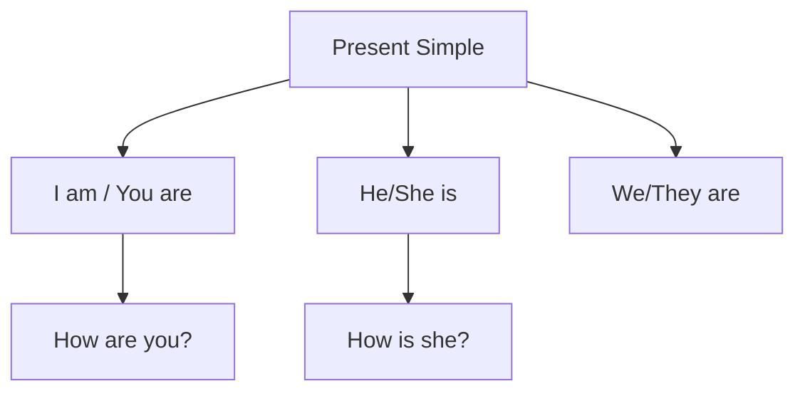
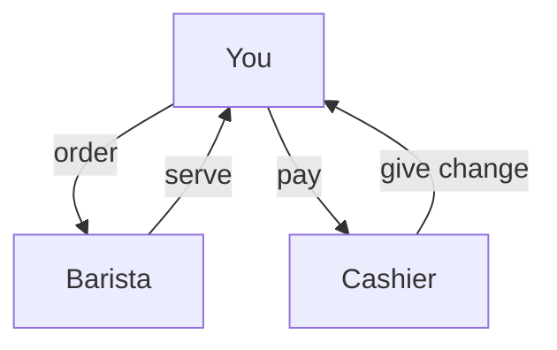
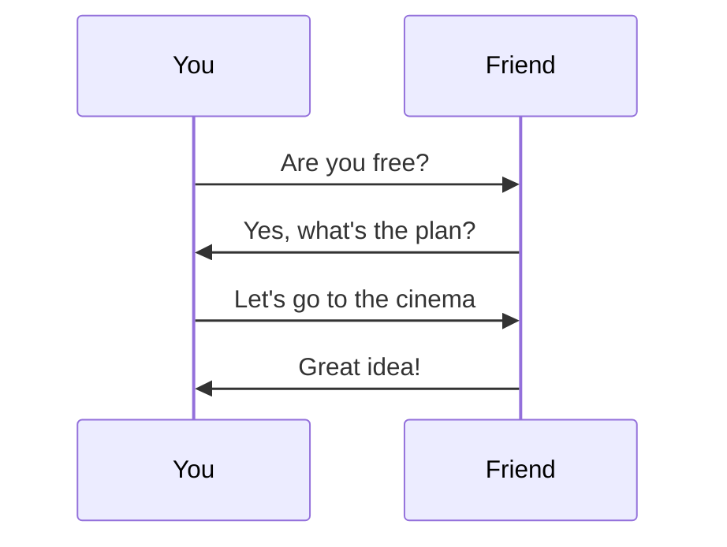
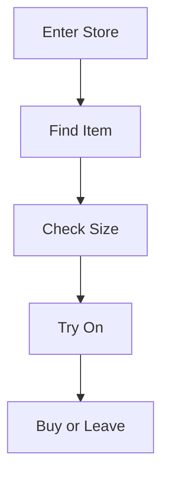
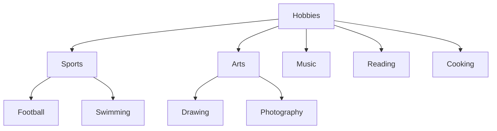
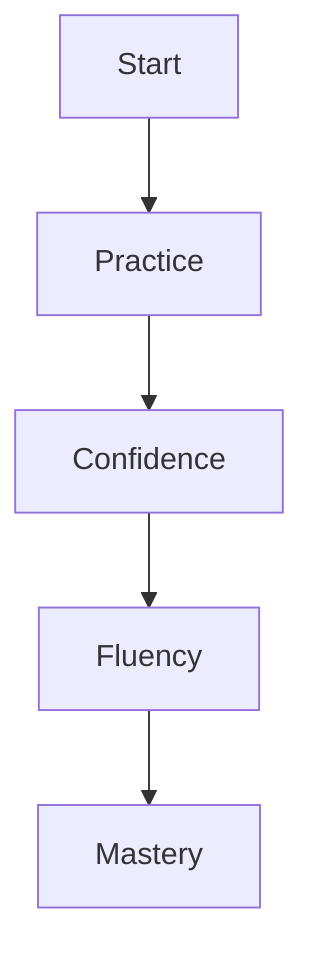
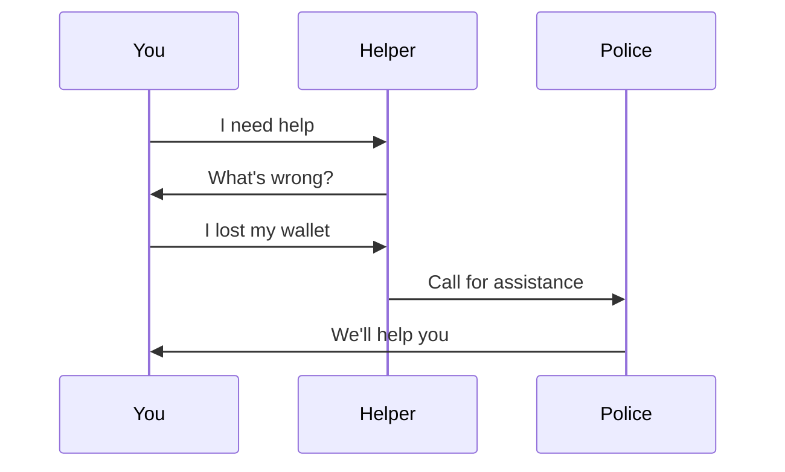
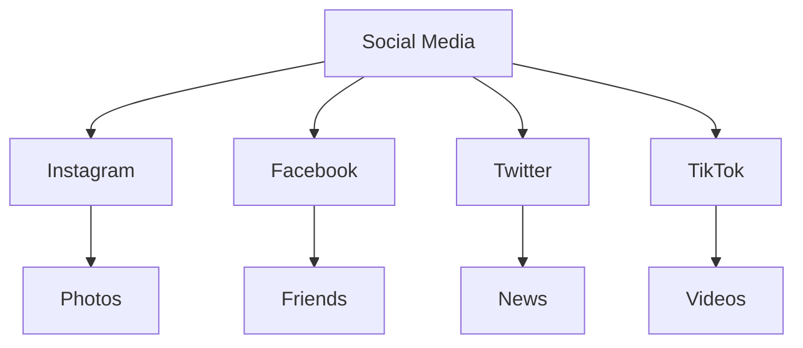
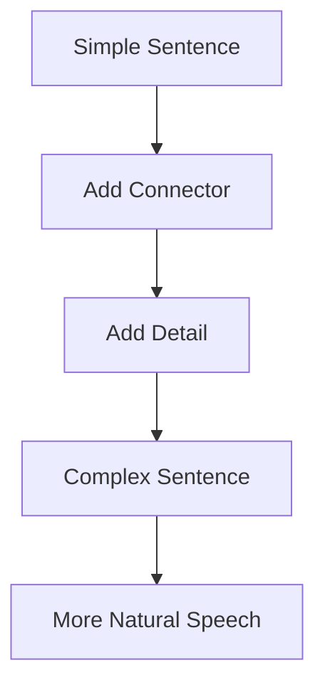
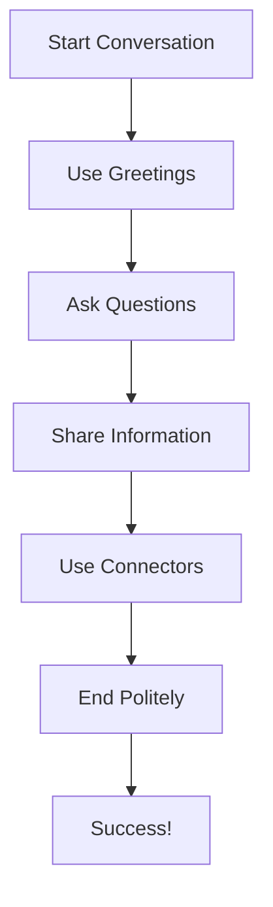

# The Joy of Learning English

> "Learning another language is like becoming another person." — Haruki Murakami

Welcome to your journey of mastering English! This book is your companion to joyful, expressive, and confident communication. Each lesson builds upon the previous one, creating a solid foundation for your English skills.

## Lesson 1: A Morning in the Park

Imagine you are walking in a beautiful park. The sun is shining, birds are singing, and you greet a friend.

**Story:**

> Anna walks into the park and sees her friend Ben. She smiles and says, "Good morning, Ben! How are you today?"
> Ben replies, "I'm doing great, thanks! The weather is perfect for a walk."

**Vocabulary:**

- **greet** (verb): to say hello
- **smile** (verb): to make a happy face  
- **park** (noun): a place with grass and trees
- **weather** (noun): the condition of the air outside
- **perfect** (adjective): exactly right

**Practice:**

- Try greeting someone in English today. Say, "Good morning!"
- Write down three things you see in a park.
- Practice the dialogue with a friend.

**Grammar Focus:**

---

## Lesson 2: Ordering at a Café

You are at a cozy café. You want to order a coffee and a sandwich.

**Dialogue:**

> **You:** "Hello! I'd like a coffee and a sandwich, please."
> **Barista:** "Of course! Would you like anything else?"
> **You:** "No, thank you. That's all."

**Useful Phrases:**

- **I'd like…** - polite way to order
- **Anything else?** - asking for more items
- **That's all.** - finished ordering
- **Of course!** - polite agreement

**Visualize:**

**Practice Exercise:**

**Role Play:** Practice this dialogue with a partner. Switch roles and try different food items!

---

## Lesson 3: Making Plans with Friends

You want to invite friends to see a movie this weekend.

**Conversation:**

> **You:** "Hey Sarah! Are you free this weekend?"
> **Sarah:** "I think so. What do you have in mind?"
> **You:** "I was thinking we could see the new movie at the cinema."
> **Sarah:** "That sounds great! What time?"

**Vocabulary Building:**

- **free** (adjective): not busy
- **weekend** (noun): Saturday and Sunday
- **cinema** (noun): movie theater
- **sounds great** (phrase): good idea

**Making Plans Flow:**

---

## Lesson 4: Shopping for Clothes

You're at a clothing store and need help finding the right size.

**Store Dialogue:**

> **You:** "Excuse me, do you have this shirt in a larger size?"
> **Assistant:** "Let me check for you. What size are you looking for?"
> **You:** "I usually wear medium, but this one seems small."
> **Assistant:** "Here's a large. Would you like to try it on?"

**Shopping Vocabulary:**

- **excuse me** - polite way to get attention
- **larger size** - bigger size
- **try on** - put on clothes to see if they fit
- **usually** - most of the time

**Shopping Process:**

---

## Lesson 5: Talking About Hobbies

You're meeting new people and want to share your interests.

**Introduction:**

> **You:** "Hi, I'm Alex. What do you like to do in your free time?"
> **New Friend:** "I love reading and playing guitar. How about you?"
> **You:** "I enjoy cooking and hiking. Do you like outdoor activities?"

**Hobby Expressions:**

- **I love...** - strong like
- **I enjoy...** - like doing something
- **How about you?** - asking the same question back
- **free time** - time when you're not working

**Hobby Categories:**

---

## Chapter 1: Getting Started

- English opens doors to new opportunities.
- Practice daily for best results.
- Don't be afraid to make mistakes.
- Listen to native speakers when possible.

## Chapter 2: Visualize Progress

**Progress Tracking:**

**Tip:** Keep a journal of new words and phrases you learn. Review them weekly to reinforce your memory!

---

## Lesson 6: Emergency Situations

Knowing how to ask for help is crucial when traveling.

**Emergency Phrases:**

> **You:** "Excuse me, I need help. I lost my wallet."
> **Helper:** "Don't worry. Let me help you find it."
> **You:** "Thank you so much. I'm really grateful."

**Important Vocabulary:**

- **emergency** - urgent situation
- **lost** - can't find something
- **grateful** - thankful
- **don't worry** - calming phrase

**Emergency Flow:**

---

## Lesson 7: Technology and Social Media

Talking about apps, social media, and digital communication.

**Tech Conversation:**

> **Friend:** "Do you use Instagram?"
> **You:** "Yes, I love sharing photos. Do you follow many people?"
> **Friend:** "I follow about 200 people. How about you?"
> **You:** "I follow around 150. I try to keep it manageable."

**Tech Vocabulary:**

- **app** - application on phone
- **follow** - subscribe to someone's posts
- **manageable** - easy to handle
- **share** - post for others to see

**Social Media Types:**

---

## Chapter 3: Advanced Communication

**Advanced Tip:** Learn to use connecting words like "however," "therefore," and "meanwhile" to make your speech more fluent and sophisticated.

**Connecting Words:**

- **However** - but, on the other hand
- **Therefore** - so, as a result
- **Meanwhile** - at the same time
- **Furthermore** - in addition

**Complex Sentence Structure:**

---

## Final Challenge: Real-World Application

**Your Mission:** Use everything you've learned to have a 10-minute conversation in English with a native speaker or language partner. Focus on using the phrases and vocabulary from all lessons!

**Conversation Topics:**

- Talk about your weekend plans
- Discuss your favorite hobbies
- Share a recent experience
- Ask for recommendations

**Success Checklist:**

---

## Congratulations!

You've completed the foundational English course! Remember, language learning is a journey, not a destination. Keep practicing, stay curious, and enjoy the process of becoming more confident in English.

**Next Steps:**

- Practice with native speakers
- Watch English movies and TV shows
- Read English books and articles
- Join English conversation groups

> "The limits of my language mean the limits of my world." — Ludwig Wittgenstein
