# The Hyplab Platform: A Step-by-Step Design Guide

Hyplab is a platform for building AI agent simulations. It is a set of powerful, reusable components that can be assembled into any product we can imagine.

### The Big Picture

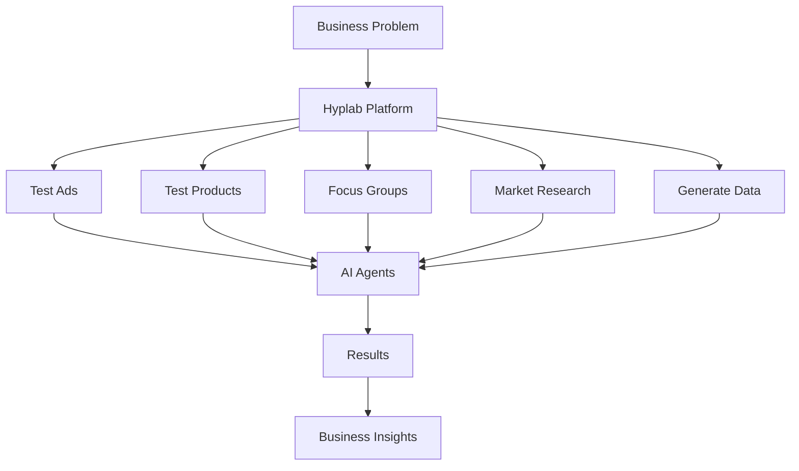

**In simple terms:**

- You have a business problem (Which ad works best? Will people buy this product?)
- Hyplab creates fake people (AI agents) with different personalities
- These agents react to your ads, products, or questions
- You get back answers about what works and what doesn't, and use these answers to make better business decisions

-----

## Chapter 1: Our Foundational Philosophy

Before we build, we must establish the plan.

We are not building a single, fixed application like an "Ad Tester" or "Market Research Tool." We are building a **foundational platform**—a set of powerful, reusable components that can be assembled into any product we can imagine.

Think of it as building a custom high-performance engine. Once the engine is built, you can place it in *any* vehicle you design: a race car, a transport truck, or a family sedan.

Our system is the same. We will first build the "engine"—the core components that make everything work.

  * Our **Digital Agents** are the pistons, the "actors" with personalities who react, remember, and respond.

  * Our **Digital Environment** is the "chassis" where they operate and interact.

  * Our **Core System** is the engine that makes them run: the memory, the decision-making brain, and the translator that connects to the "Big Brain" (external LLM APIs).

This book is our guide to building these core components first (Chapters 2-3). Then, we will follow simple "build plans" to assemble them into any product we can imagine (Chapter 4).

-----

## Chapter 2: Designing the Core Components

This chapter defines each core component we need to build. We will design them to be separate and self-contained, which makes them easier to build, test, and upgrade later.

### The System Blueprint

This is the master blueprint for our entire core system, which we call `hyplab-core-agent`. It shows the six main components and how they connect.

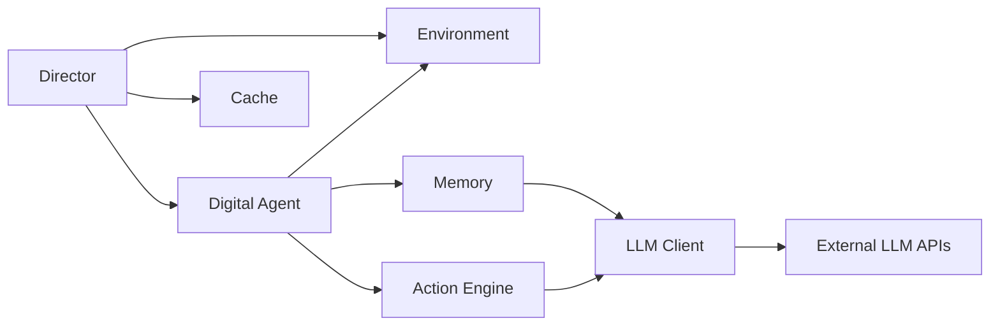

### Component 1: The 'Translator' (`hyplab-llm-client`)

  * **What It Is:** This is the first component we must build. It's a "universal translator" that lets our system talk to any "Big Brain" (like OpenAI's GPT-4, Azure OpenAI, or Anthropic's Claude) on the internet.

  * **Why we need it:** This one component handles all external communication. If we ever want to switch from OpenAI to a cheaper or better "Big Brain" provider, we only have to update this *one component*, not our entire system. This is a critical strategic decision. Everything else depends on LLM calls, so this component must handle provider switching, caching responses to save costs, retrying failed requests, and tracking usage.

  * **How it works:** Takes a message list and parameters, routes to the appropriate provider adapter (OpenAI, Azure, Anthropic), checks cache first (if enabled) using a hash of the input, makes API call with retry logic and exponential backoff, parses response, and returns structured output. Caches results to avoid duplicate expensive calls.

  * **Key features to build:**

    1.  **Multi-Provider Support:** It must have different "adapters" to speak the specific language of OpenAI, Azure, Anthropic, etc. We use a factory pattern to select the right adapter.

    2.  **Caching:** It must automatically save the answers to questions it's already asked. This will save us significant money and time during development and testing. Cache keys are generated from a hash of provider + model + parameters + messages.

    3.  **Retry Logic:** If a call to the "Big Brain" fails (e.g., a temporary network error or rate limit), this component must be smart enough to try again automatically with exponential backoff.

    4.  **Token Counting & Cost Tracking:** Track how many tokens we use and estimate costs so we can budget effectively.

<!-- end list -->

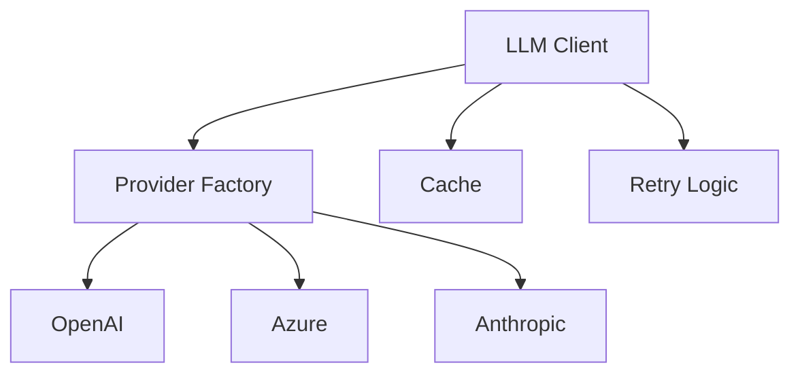

**Configuration Format:**
```ini
[LLM]
provider = openai|azure|anthropic
model = gpt-4o-mini|gpt-4|claude-3-opus
temperature = 0.7
max_tokens = 2000

[Cache]
enabled = true
cache_file = llm_cache.json

[Retry]
max_attempts = 3
waiting_time = 1.0
exponential_backoff_factor = 2.0
```

**Required Interfaces:**
- `send_message(messages, **params)`: Call LLM API
- `get_embedding(text)`: Generate embedding vector
- `cache_lookup(messages, params)`: Check cache
- `cache_store(messages, params, response)`: Store in cache
- `retry_with_backoff(call_func)`: Retry logic wrapper

### Component 2: The 'Digital Agent' (`hyplab-agent`)

  * **What It Is:** This is the core "actor" in our system. Each "Digital Agent" is a simulated human with a unique personality, background, and set of beliefs. They are the ones who will test our products, react to our ads, and participate in our focus groups.

  * **Why we need it:** These are the agents who make our simulations real. Without them, we have an empty simulation. They embody the personas that react to ads, test products, and participate in discussions. Each agent contains a persona specification (who they are), mental state (current emotions, goals, context), and memory interface.

  * **How it works:** When an agent receives input, it retrieves relevant memories (both recent events and long-term knowledge), combines this with its persona and current mental state, sends everything to the action engine for LLM-based response generation, then stores the interaction in memory. The agent can change context, make other agents accessible for communication, and generate actions in response to stimuli.

  * **Key features to build:**

    1.  **A "Persona Card":** A simple data file (like JSON) that defines *who* this person is: their age, job, personality traits (Big Five), preferences, beliefs, behaviors, long-term goals, and communication style. This is their static "DNA."

    2.  **A "Current State" (Mental State):** A dynamic tracker for their *current* mood, context, location, goals, attention, emotions, and which other agents they can communicate with. This changes as the simulation progresses.

    3.  **Plug-in Slots:** Empty "ports" where we will plug in their "Memory" and "Brain" (our other components). The agent doesn't need to know how these work internally—it just uses them.

    4.  **Action Generation:** The ability to receive stimuli, process them with context, and generate structured actions (TALK, THINK, DONE) that can be routed to other agents or the environment.

<!-- end list -->

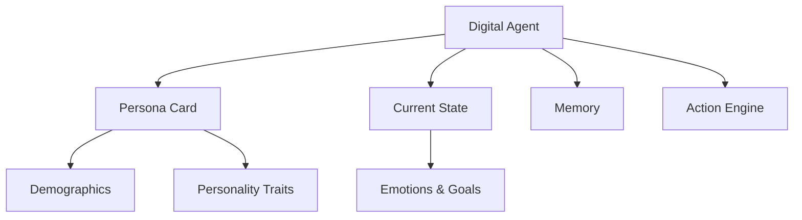

**Persona Data Format:**
```json
{
  "name": "string",
  "age": "number",
  "gender": "string",
  "nationality": "string",
  "residence": "string",
  "education": "string",
  "occupation": {
    "title": "string",
    "organization": "string",
    "description": "string"
  },
  "personality": {
    "traits": ["string"],
    "big_five": {
      "openness": "string",
      "conscientiousness": "string",
      "extraversion": "string",
      "agreeableness": "string",
      "neuroticism": "string"
    }
  },
  "preferences": {
    "interests": ["string"],
    "likes": ["string"],
    "dislikes": ["string"]
  },
  "beliefs": ["string"],
  "behaviors": {
    "routines": ["string"],
    "habits": ["string"]
  },
  "long_term_goals": ["string"],
  "style": "string"
}
```

**Required Interfaces:**
- `listen(stimulus, source)`: Receive input from environment/agents
- `act(until_done, return_actions)`: Generate actions
- `listen_and_act(stimulus, return_actions)`: Combined operation (convenience method)
- `think(thought)`: Internal thought generation
- `change_context(context_list)`: Update mental state context (takes list)
- `make_agent_accessible(agent, relation_description)`: Enable communication with specific agent
- `load_specification(path_or_dict)`: Load agent from JSON file or dict
- `pretty_current_interactions(max_content_length)`: Get formatted interaction history for extraction

### Component 3: The 'Memory' (`hyplab-memory`)

  * **What It Is:** This component plugs into the "Digital Agent." It gives them a functional memory so they can remember past conversations and experiences.

  * **Why we need it:** An agent who forgets what you said 30 seconds ago is not realistic or useful. This component allows our agents to have context-aware, multi-turn conversations and recall past experiences. Without memory, agents feel robotic—they forget previous interactions and can't build on past conversations.

  * **How it works:** The memory system has two parts. **Episodic memory** stores recent events in order (conversations, thoughts, actions) with a fixed prefix (always include first N events) and lookback window (last M events). **Semantic memory** stores information as vector embeddings, allowing relevance-based retrieval. When retrieving, it combines both: recent events + semantically relevant past knowledge. This gives agents both immediate context and long-term recall.

  * **Key features to build:**

    1.  **A "Short-Term Diary" (Episodic Memory):** A list of *exactly* what just happened (e.g., "Lisa just asked me about a new soda..."). This provides immediate conversational context. We maintain a fixed prefix (first few events) and a lookback window (last N events) to ensure important context is always included.

    2.  **A "Long-Term Encyclopedia" (Semantic Memory):** A smart, searchable database of their past experiences stored as vector embeddings. This lets them find *relevant* memories (e.g., "Find all memories related to 'soda'"), not just the *last* one. We use cosine similarity to find relevant memories.

    3.  **Memory Consolidation:** When episodes get too long, we can summarize and archive old memories to keep the system efficient.

<!-- end list -->

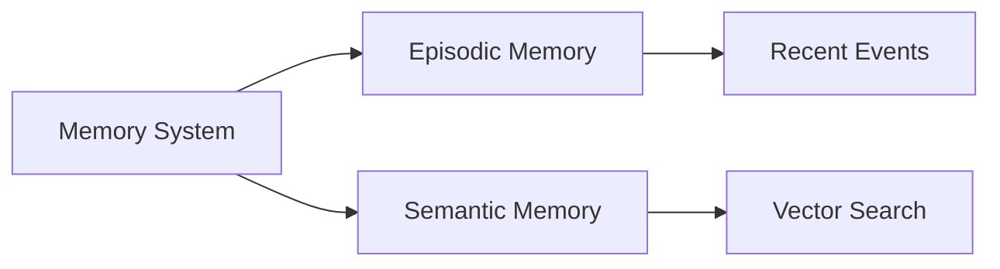

**Memory Retrieval Parameters:**
```json
{
  "episodic": {
    "fixed_prefix_length": 5,
    "lookback_length": 10,
    "item_type": "CONVERSATION|THOUGHT|ACTION|EVENT|null"
  },
  "semantic": {
    "relevance_target": "query string",
    "top_k": 5,
    "item_type": "string|null"
  }
}
```

**Required Interfaces:**
- `store(event)`: Store event in episodic memory
- `store_semantic(content, metadata)`: Store in semantic memory
- `retrieve_recent(n, item_type)`: Get recent episodic memories
- `retrieve_relevant(query, top_k)`: Semantic search
- `consolidate_episode()`: Summarize and archive old episodes
- `retrieve_all(item_type)`: Get all memories of type

### Component 4: The 'Brain' (`hyplab-action-engine`)

  * **What It Is:** This powerful component also plugs into the "Digital Agent." It's the "decision-maker"—the system that converts agent state (persona + memories + stimulus) into LLM prompts, calls the LLM, parses responses into structured actions, and validates quality.

  * **Why we need it:** This is where the "magic" happens—turning agent specifications into realistic behavior. The "Brain" is what *uses* the Persona and Memory to decide what to do or say next. It handles the complex prompt engineering, ensures actions match the persona, and validates quality before returning.

  * **How it works:** Builds a dynamic prompt from persona spec, mental state, relevant memories (episodic + semantic), and current stimulus. Sends to LLM with structured output format (JSON). Parses JSON response into action objects (TALK, THINK, DONE). Optionally validates quality (persona adherence, consistency, fluency) and regenerates if needed. Uses Mustache templates for prompt construction.

  * **Key features to build:**

    1.  **A "Prompt Builder":** This piece gathers all the information: "Who am I?" (from Persona), "What do I remember?" (from Memory), "What's happening now?" (from Current State), and "What's the stimulus?" (from input). It constructs a comprehensive system prompt and user message.

    2.  **A "Translator Link":** It sends all that information to our "Translator" component (`hyplab-llm-client`) to get a response from the "Big Brain."

    3.  **A "Response Parser":** It takes the "Big Brain's" text response and turns it into a *structured command* (e.g., Action: `TALK`, Content: `I love this!`, Target: `agent_name`). This is vital for making the agent's behavior predictable and easy to analyze.

    4.  **A "Quality Checker" (Optional):** Before returning an action, it can validate that the action matches the persona, is self-consistent, and is fluent. If quality is low, it can regenerate with feedback.

<!-- end list -->

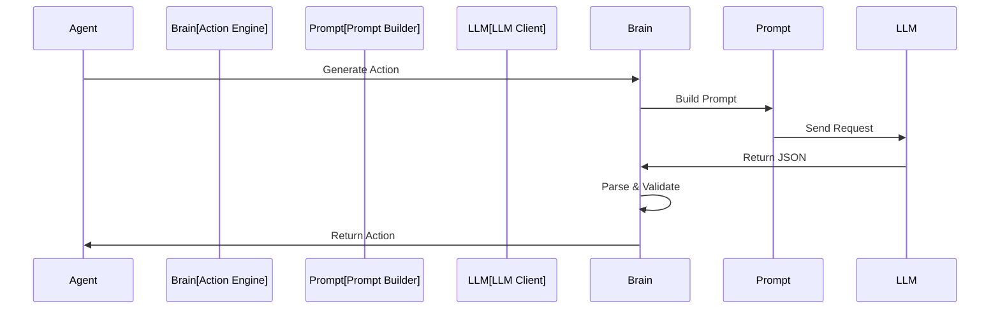

**Action Response Format (from LLM):**
```json
{
  "action": {
    "type": "TALK|THINK|DONE",
    "content": "string",
    "target": "string|null"
  },
  "cognitive_state": {
    "reasoning": "string",
    "emotions": "string",
    "goals": ["string"]
  }
}
```

**Required Interfaces:**
- `generate_next_action(agent, current_messages)`: Generate action
- `validate_action(action, agent)`: Check quality
- `regenerate_action(action, feedback)`: Improve action
- `build_prompt(agent)`: Construct LLM prompt
- `parse_response(response)`: Extract structured action

### Component 5: The 'Digital Environment' (`hyplab-environment`)

  * **What It Is:** This is the "simulation room." It's the digital space where we *put* our "Digital Agents" to live and interact. It manages agent-to-agent communication, coordinates simulation steps, and tracks time progression.

  * **Why we need it:** Agents can't just float in a void. The "Environment" is what manages the simulation. It knows who is in the room, manages time, and acts as the "conversation router." Without it, agents can't talk to each other, and we can't coordinate multi-agent interactions.

  * **How it works:** Maintains a registry of all agents. When an agent generates an action, the environment routes it to the intended target(s). Executes steps where all agents act (in parallel or sequentially), advances simulated time, and tracks all communications for analysis. Supports broadcasting (to all agents) and targeted routing (to specific agents).

  * **Key features to build:**

    1.  **A "Guest List" (Agent Registry):** A list of every "Digital Agent" currently in the simulation, with a mapping from name to agent object.

    2.  **A "Conversation Router":** When one agent `TALK`s, this router makes sure the *right* agents "hear" it (e.g., a "broadcast" to everyone or a "targeted" message to one agent). It maintains an accessibility matrix (who can talk to whom).

    3.  **A "Turn Manager" (Step Executor):** This is the "game clock." When we tell the environment to `run(steps)`, it gives every agent a "turn" to think and act. It can execute agents in parallel (faster) or sequentially (more predictable).

    4.  **A "Clock":** Tracks simulated time progression. Each step advances time by a configurable amount (e.g., 1 minute per step).

<!-- end list -->

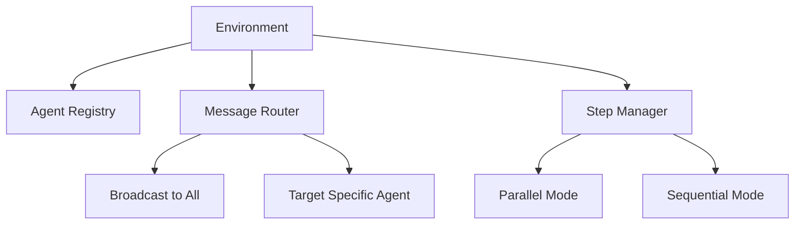

**Action Format:**
```json
{
  "type": "TALK|THINK|DONE|REACH_OUT|custom",
  "content": "string",
  "target": "agent_name|ALL|null",
  "source": "agent_name",
  "metadata": {}
}
```

**Required Interfaces:**
- `add_agent(agent)`: Register agent in environment (called automatically on init)
- `remove_agent(agent)`: Unregister agent
- `make_everyone_accessible()`: Enable all-to-all communication (sets accessibility for all agents)
- `run(steps, timedelta_per_step, parallelize)`: Execute multiple steps
- `broadcast(speech, source)`: Send message to all agents
- `broadcast_thought(thought)`: Broadcast internal thought to all agents
- `get_agent_by_name(name)`: Retrieve agent by name from registry

### Component 6: The 'Director' (`hyplab-simulation-controller`)

  * **What It Is:** This is *our* tool, the "Director's Chair." It's not *in* the simulation; it *controls* the simulation from the outside. It manages simulation lifecycle, saves/restores state, and implements caching to avoid re-running expensive LLM calls.

  * **Why we need it:** Simulations are expensive (LLM calls) and slow. We *must* have "Save" and "Load" buttons to be efficient. The controller enables resumable simulations, state checkpoints, and hash-based caching so identical steps don't need to re-run. This makes testing 100x faster.

  * **How it works:** Manages simulation lifecycle (start, pause, stop). Tracks all agents and environments. Implements transaction boundaries (begin/checkpoint/end) for state saving. Uses hash-based caching where cache key = hash of state, so identical states return cached results. Enables state restoration from checkpoints.

  * **Key features to build:**

    1.  **A "Save/Load" System:** The ability to "freeze" the entire simulation (every agent's mood, memory, etc.) and save it to a file, then load it back up later. This is done via JSON serialization of all agent and environment states.

    2.  **A "Shortcut Button" (Caching):** This is its most important feature. The "Director" must be smart. If it sees we're about to run a step it has *already run before* (with the exact same inputs), it should just load the *result* from its "Shortcut" file instead of running all the expensive "Big Brain" calls again. Cache keys are generated from a hash of the simulation state.

    3.  **Transaction Management:** Provides `begin()`, `checkpoint()`, and `end()` methods to create transaction boundaries. This allows us to save state at any point and resume later.

<!-- end list -->

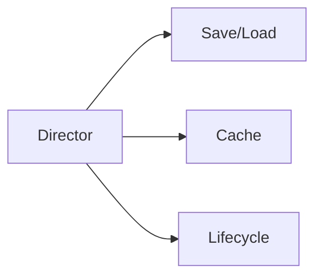

**Required Interfaces:**
- `begin(cache_path, auto_checkpoint)`: Start simulation
- `checkpoint()`: Save current state
- `end()`: End transaction and persist
- `restore_state(state)`: Restore from saved state
- `get_cache_key(state)`: Generate cache key hash
- `lookup_cache(cache_key)`: Find cached state
- `store_cache(cache_key, state)`: Store in cache

### Our "Utility" Components

With the 6 core components, our foundation is complete. We'll add two "utility" components on top to make building our final products *much* easier.

#### 1. The "Persona Factory" (`hyplab-persona-factory`)

  * **What it is:** Instead of writing hundreds of "Persona Cards" by hand, this tool does it for us. It programmatically generates persona specifications using LLMs.

  * **Why we need it:** For large-scale simulations (100+ agents), manually creating personas is impractical. The factory enables generating diverse, realistic personas quickly and automatically.

  * **How it works:** Takes demographic specifications (age ranges, income levels, geographic distribution, occupation categories) and context. Uses LLM (via `hyplab-llm-client`) to generate persona JSON matching the specs. Supports parallel generation and uniqueness checking to avoid duplicates.

  * **Required Interfaces:**
    - `generate_person(description)`: Generate single persona (returns hyplab-agent instance)
    - `generate_people(number_of_people, parallelize)`: Generate multiple personas (returns list of agents)
    - `create_factory_from_demography(demography, population_size, context)`: Static method - creates factory from demographics

#### 2. The "Extraction Utility" (`hyplab-extraction`)

  * **What it is:** After a simulation, our agents have pages of conversation in their "Memories." This tool reads that entire conversation and "extracts" the simple answers we need in structured format (JSON, CSV).

  * **Why we need it:** Agent responses are natural language. To analyze results (sentiment, preferences, feedback), you need structured data. Extraction converts conversations into usable formats.

  * **How it works:** Takes an extraction schema (what fields to extract) and agent/environment state. Accesses agent's `pretty_current_interactions()` to get formatted conversation history. Uses LLM (via `hyplab-llm-client`) with structured output to analyze conversations and extract structured data matching the schema. Returns JSON with extracted fields, confidence scores, and raw responses.

  * **Required Interfaces:**
    - `extract_results_from_agent(agent, extraction_objective, situation, fields, fields_hints)`: Extract from single agent
    - `extract_results_from_world(world, extraction_objective, situation, fields, fields_hints)`: Extract from environment
    - `extract_results_from_agents(agents, extraction_objective, situation, fields, fields_hints)`: Batch extraction from multiple agents

-----

## Chapter 3: Our Step-by-Step Build Order

Now we have our 6 core components and 2 utilities. Here is the logical order to build them, from the simplest to the most complex. This is the roadmap for the engineering team.

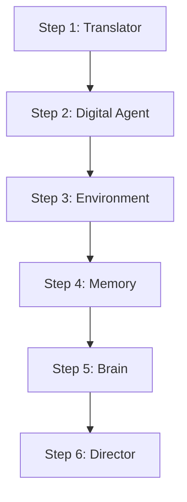

**Why this order?**

1. **The 'Translator' first:** Everything else depends on LLM calls. We must build this foundation before we can test anything.

2. **The 'Digital Agent' second:** Once we can talk to LLMs, we can create agents. We start simple (just persona + basic action generation) without memory or complex routing.

3. **The 'Digital Environment' third:** Now we can test multiple agents interacting. This is where we see our system come to life.

4. **The 'Memory' fourth:** Add memory to agents so they can remember past conversations. This makes them realistic.

5. **The 'Brain' fifth:** Upgrade the action engine with quality checks and better prompt engineering. This makes agents more reliable.

6. **The 'Director' last:** Add state management and caching. This makes the system production-ready and efficient.

-----

## Chapter 4: Building Our First Products (The Use Cases)

Our core system (`hyplab-core-agent`) is finished. We have our complete set of components.

Now, we can build *anything*.

All our products will be built using the **same 4-phase pattern**. This simple, repeatable recipe is our entire business logic.

### The Universal 4-Phase Build Plan

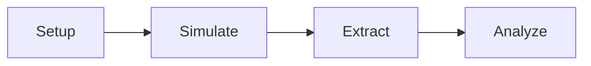

**1. Phase 1: Setup**

   * Grab the **'Director'** and press `begin(cache_path)`. This starts a simulation transaction and enables state caching.

   * Use the **'Persona Factory'** to create our "Digital Agents" (or load them from JSON files). The factory uses `create_factory_from_demography()` to set up demographics, then `generate_people()` to create agents.

   * Place them in a **'Digital Environment'**. Create the environment with the agents, and call `make_everyone_accessible()` if you want all agents to communicate with each other.

**2. Phase 2: Simulate**

   * Give the "Digital Agents" a "stimulus" (an ad, a product idea, a question). Use `agent.change_context()` to set the situation, then `agent.listen_and_act()` to present the stimulus.

   * For multi-agent interactions, use `environment.broadcast()` to send messages to all agents, then `environment.run(steps)` so they can think, react, and talk to each other.

**3. Phase 3: Extract**

   * Use our **'Extraction Utility'** to get simple, structured answers from each "Digital Agent's" memory. The extractor reads the agent's interaction history via `pretty_current_interactions()`, uses LLM to extract structured data matching your schema, and returns JSON.

**4. Phase 4: Analyze**

   * Collect the simple, structured answers and find the result (e.g., "Which ad won?"). Convert to DataFrame, apply domain-specific analysis (statistics, sentiment, ranking), and generate reports.

### How it works Internally

**When an agent receives a stimulus:**

1. Agent receives stimulus via `listen_and_act()` → Stored in `current_messages` buffer
2. Agent calls `reset_prompt()` → Retrieves memories via `retrieve_recent_memories()`
3. Memory retrieval combines: episodic (fixed prefix + lookback) + semantic (relevance search)
4. Builds system prompt from persona + mental state + memories
5. Calls `action_generator.generate_next_action()` → Uses `hyplab-action-engine`
6. Action engine builds prompt → Calls `hyplab-llm-client.send_message()`
7. LLM returns JSON → Action engine parses → Validates quality (if enabled)
8. Action stored in episodic memory → Returns action to environment

**When the environment runs:**

1. For each step: environment calls `_step()` on all agents
2. Agents act in parallel (if enabled) or sequentially
3. Each agent's actions collected in `_actions_buffer`
4. Environment routes actions to targets via `route_action()`
5. Targeted agents receive actions via `listen()`
6. Communication history tracked in environment
7. Time advances per `timedelta_per_step`

**When extracting results:**

1. Extractor accesses agent's `pretty_current_interactions(max_content_length=None)` (formatted conversation history from episodic memory)
2. Builds extraction prompt with: extraction_objective, situation, fields, field_hints, interaction history
3. Uses Mustache template for prompt structure
4. Calls LLM via `hyplab-llm-client` with temperature=0.0 for deterministic extraction
5. Parses JSON response (handles markdown code blocks)
6. Caches results in extractor's dictionary

-----

### Use Case 1: Digital Advertising Tester

  * **Objective:** Find out which of our 3 new ads is the most effective.

  * **Core Components Used:** Director, Translator, Persona Factory, Digital Agent (x50), Memory, Brain, Digital Environment, Extraction Utility.

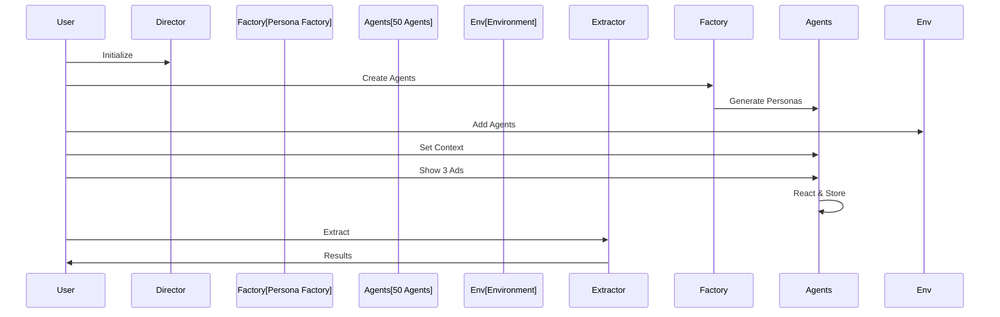

  **How It Works:**

  **Phase 1: Setup** 
  
  We start by initializing the Director component, which enables state caching to save time and money on repeated simulations. Next, we use the Persona Factory to automatically create 50 digital agents that match our target demographic—in this case, males aged 18-25 who are interested in sports. Each agent has a unique personality, background, and preferences. Finally, we place all 50 agents into a Digital Environment where they can interact.

  **Phase 2: Simulate**
  
  We set the context for all agents: "Your TV broke and you need a new one." This gives them a realistic scenario. Then we divide the agents into three equal groups. Each group sees a different ad for televisions. The agents process each ad through their unique personalities—some might focus on price, others on features, and some on emotional appeal. Their reactions and thoughts are stored in their memory systems.

  **Phase 3: Extract**
  
  After the agents have viewed and reacted to the ads, we use the Extraction Utility to read each agent's memory and determine which ad they preferred. The extractor asks structured questions like "Which ad did you choose?" and "Why did you choose it?" and converts the natural language responses into structured data we can analyze.

  **Phase 4: Analyze**
  
  We collect all the structured responses and perform statistical analysis. We count how many agents chose each ad, analyze the sentiment of their justifications, and identify patterns. The result might be: "Ad #2 had the highest 'buy' score, but Ad #1 had the best 'emotional' score." This gives us clear, actionable insights about which ad resonates most with our target audience.

### Use Case 2: Product Concept Tester

  * **Objective:** See if people would buy our new "ready-to-drink bottled gazpacho" idea.

  * **Core Components Used:** All the same components as Use Case 1.

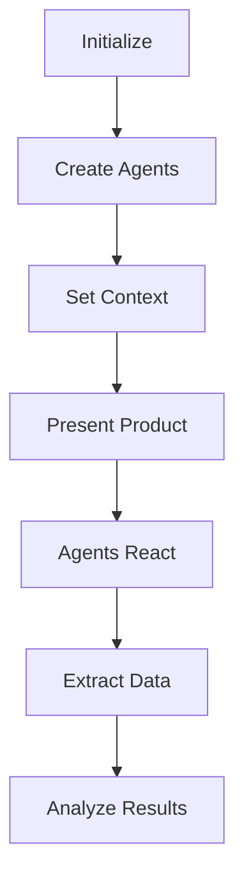

  **How It Works:**

  **Phase 1: Setup**
  
  We initialize the Director and create 100 digital agents using the Persona Factory. These agents represent our target market—busy professionals who are health-conscious. Each agent has different preferences, budgets, and shopping behaviors. We place them all in a Digital Environment where they can experience our product concept.

  **Phase 2: Simulate**
  
  We set the scene: all agents are at a grocery store looking for a quick, healthy lunch option. Then we broadcast a detailed description of our new product—ready-to-drink bottled gazpacho—including its price, ingredients, and benefits. The agents process this information through their unique perspectives. Some might love the convenience, others might question the price, and some might be confused about the concept. The environment runs one simulation step, allowing all agents to think and form their opinions.

  **Phase 3: Extract**
  
  We use the Extraction Utility to ask each agent structured questions about their reaction to the product. We extract their interest level (on a scale of 1-10), their purchase intent (yes, no, or maybe), their main concerns, and any feature requests they might have. This converts their natural language thoughts into structured data we can analyze.

  **Phase 4: Analyze**
  
  We calculate statistics across all 100 agents: average interest level, percentage who would purchase, common concerns, and requested features. The result might reveal: "The average interest was 3/10. 80% of agents said the 'price was too high' and 60% were 'confused by the concept'." This gives us clear feedback on what needs to change before launching the product.

### Use Case 3: Focus Group Simulation

  * **Objective:** Brainstorm new feature ideas for our software with a group of "experts."

  * **Core Components Used:** All the same components, but we'll use the Digital Environment differently for multi-agent interactions.

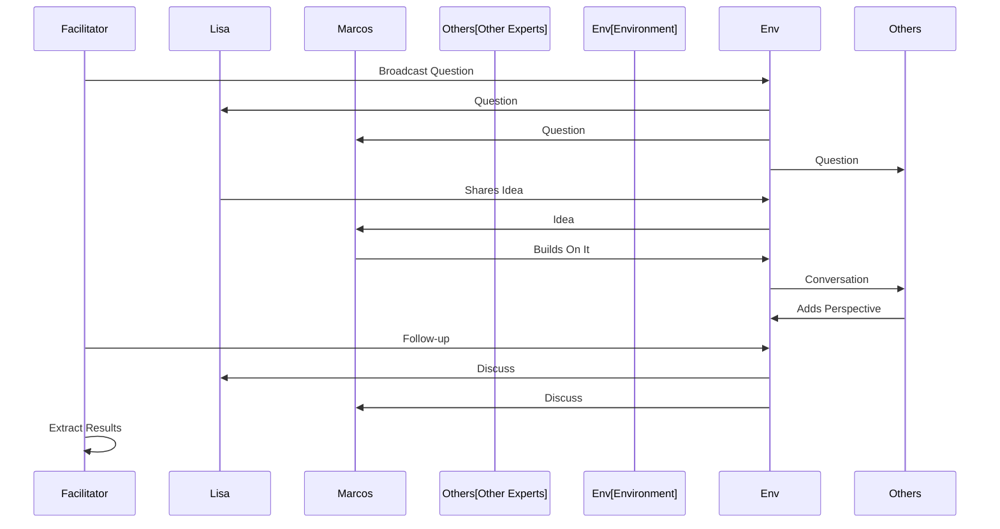

  **How It Works:**

  **Phase 1: Setup**
  
  Unlike the previous use cases, we don't use the Persona Factory here. Instead, we hand-craft 8 expert agents with specific roles and expertise. For example, "Lisa" is a senior designer, "Marcos" is a lead engineer, and we create 6 other experts with different backgrounds. We place all 8 agents in a single Digital Environment. Crucially, we enable all-to-all communication so every agent can hear and respond to every other agent—just like a real focus group.

  **Phase 2: Simulate**
  
  A facilitator (which could be another agent or a system message) broadcasts an opening question to everyone: "Hi everyone, we're here to brainstorm new AI features. What's the biggest problem you face in your daily work?" The environment then runs 4 simulation steps. During these steps, agents don't just respond to us—they talk to each other. One agent's idea triggers another agent's response, which sparks a third agent's thought. The conversation unfolds naturally, with agents building on each other's ideas, asking clarifying questions, and sometimes disagreeing. After the initial discussion, the facilitator asks a follow-up question: "Now add more details to these ideas. How would they integrate with Word?" The environment runs 2 more steps, allowing agents to deepen their discussion.

  **Phase 3: Extract**
  
  We use the Extraction Utility, but instead of asking for simple numbers or ratings, we ask it to read the entire conversation log and extract comprehensive insights. We select one agent (like "Lisa") who witnessed the entire conversation as our rapporteur. The extractor identifies all ideas discussed, key themes that emerged, points where agents agreed (consensus), and areas where they disagreed.

  **Phase 4: Analyze**
  
  We review the extracted themes and ideas. The result might be: "The group generated 5 new ideas. The main consensus was that 'Idea #3' was the most valuable, but 'Lisa' and 'Marcos' disagreed on how to implement it." This gives us rich, qualitative insights that would be expensive and time-consuming to gather from real human focus groups.

### Use Case 4: Market Research

  * **Objective:** Conduct market research using AI personas representing different market segments. Gather insights on preferences, behaviors, and trends faster and cheaper than traditional methods.

  * **Core Components Used:** All the same components, plus statistical analysis tools.

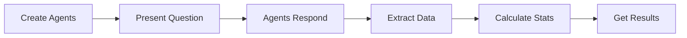

  **How It Works:**

  **Phase 1: Setup**
  
  We initialize the Director and use the Persona Factory to create 50 agents that represent a diverse market segment. In this example, we target Americans aged 18-65 with diverse occupations, income levels, and lifestyles. This gives us a representative sample that mirrors real market demographics. We place all agents in a Digital Environment configured for market research.

  **Phase 2: Simulate**
  
  We set the context for all agents: they are participating in a market research survey. Then we present them with a specific research question: "Would you consider purchasing ready-to-drink bottled gazpacho if it was available? Rate from 1 (never) to 5 (certainly)." Each agent processes this question through their unique personality, background, and preferences. A health-conscious agent might rate it highly, a price-sensitive agent might rate it lower, and a convenience-focused agent might see value in the ready-to-drink format. Each response is authentic to that agent's persona.

  **Phase 3: Extract**
  
  We use the Extraction Utility to batch extract responses from all agents. For each agent, we capture their name, their rating (1-5), and their justification for that rating. This converts their natural language thoughts into structured data we can analyze statistically.

  **Phase 4: Analyze**
  
  We perform statistical analysis on the collected responses. We count how many agents gave each rating, calculate what percentage gave positive responses (4 or 5), and analyze the justifications to understand common themes. If more than 30% of agents give positive ratings, we might conclude: "Market looks promising!" This gives us fast, cost-effective market insights that would normally require expensive surveys and weeks of analysis.

### Use Case 5: Synthetic Data Generation

  * **Objective:** Generate realistic synthetic datasets through persona interactions. Creates training data, test data, or analysis datasets without privacy concerns.

  * **Core Components Used:** All the same components, plus schema management and data validation.

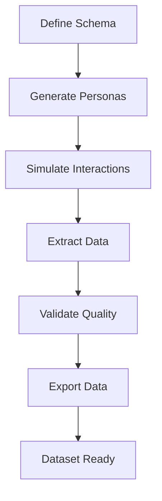

  **How It Works:**

  **Phase 1: Setup**
  
  We start by defining the data schema we need—what fields we want, their data types (numbers, categories, text), and any constraints (age ranges, valid values, etc.). For example, we might need data about customer age, income level, purchase behavior, and product preferences. Then we use the Persona Factory to generate agents that match our target distribution. If we need 40% of our data to be from high-income individuals, we generate 40% of our agents with high-income personas.

  **Phase 2: Simulate**
  
  We place the agents in a Digital Environment and simulate interactions relevant to our data schema. If we need purchase behavior data, we simulate shopping scenarios. If we need preference data, we simulate decision-making situations. The agents interact naturally, and their behaviors are authentic to their personas. The environment runs multiple simulation steps, generating a rich interaction history.

  **Phase 3: Extract**
  
  We use the Extraction Utility to extract structured data that matches our schema. The extractor reads each agent's interaction history and pulls out the specific fields we need—age, income, purchase decisions, preferences, etc. The data is automatically formatted to match our schema requirements.

  **Phase 4: Analyze**
  
  We validate the extracted data for quality and realism. We check that the data is consistent (no impossible combinations), realistic (values make sense), and matches our target distribution. Then we export the data to common formats like CSV, JSON, or Parquet. Finally, we verify that the final dataset's distribution matches our target requirements. The result is a realistic synthetic dataset that can be used for training machine learning models, testing systems, or analysis—all without privacy concerns since it's generated, not collected from real people.

-----

## Chapter 5: Our Architectural Foundation

This is the Hyplab method. By building these 6 core components and 2 utilities, we have not just built one product. We have built a **platform**.

### Our Design Philosophy

Our design philosophy is simple and powerful:

  * **Separation of Concerns:** Our components are simple and focused. The "Digital Agent" doesn't know how the "Translator" works. It just *uses* it. This makes our system easy to maintain, debug, and upgrade. Each component has a single, well-defined responsibility.

  * **Composability:** Agents can work in any environment. Memory can plug into any agent. Factories can generate personas for any scenario. This modularity means we can mix and match components to create new use cases quickly.

  * **Extensibility:** Now, your team can invent a new product (a new use case) in an afternoon. They don't need to build a new system from scratch; they just need to write a new "4-Phase Build Plan" using the components we already have. The core handles agents and interactions; use cases add domain logic.

  * **Testability:** We can test each component independently. Mock the LLM client to test agents without making real API calls. Test agents in isolation. Test environments with mock agents. This makes our system reliable and maintainable.

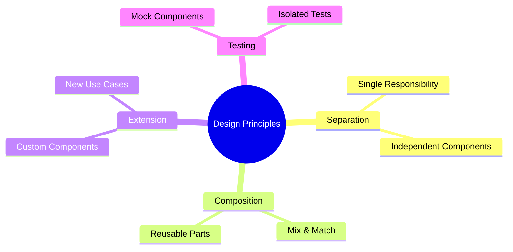

### Success Metrics

**Core Platform:**
- Functional: All agents generate realistic responses matching their personas
- Performance: < 5s per agent action (with caching)
- Quality: > 80% persona adherence in generated actions
- Cost: < $0.10 per simulation step (with caching)
- Reliability: 99% simulation completion rate

**Use Cases:**
- Advertising: Ad ranking accuracy, sentiment accuracy
- Product Testing: Purchase intent prediction, feature prioritization
- Focus Groups: Theme extraction quality, consensus identification
- Market Research: Response rate, data quality, insight value
- Synthetic Data: Realism score, distribution match, diversity

-----

**This guide provides the architectural foundation for building the Hyplab Agent Simulation Platform. Start with `hyplab-core-agent`, then extend for specific use cases. The platform is your engine—build it once, use it everywhere.**
