# Backend Challenges: Level Up

> "Code is like humor. When you have to explain it, it's bad." — Cory House

<div class="box">
Welcome to the backend coding challenge series! Each lesson is designed to help you master real-world backend skills with clarity and elegance. These challenges simulate actual production scenarios you'll encounter in your career.
</div>

## Challenge 1: User Authentication API

Imagine you are building a modern web app. Your first task is to create a simple authentication API.

**Goal:** Accept a username and password, and return a token if valid.

```python
import hashlib
import jwt
import time
from typing import Optional

class AuthService:
    def __init__(self, secret_key: str):
        self.secret_key = secret_key
        self.users = {
            "admin": "5e884898da28047151d0e56f8dc6292773603d0d6aabbdd62a11ef721d1542d8"  # "password"
        }

    def authenticate(self, username: str, password: str) -> Optional[str]:
        if username in self.users:
            hashed_password = hashlib.sha256(password.encode()).hexdigest()
            if hashed_password == self.users[username]:
                payload = {
                    "username": username,
                    "exp": time.time() + 3600  # 1 hour
                }
                return jwt.encode(payload, self.secret_key, algorithm="HS256")
        return None
```

**API Flow:**

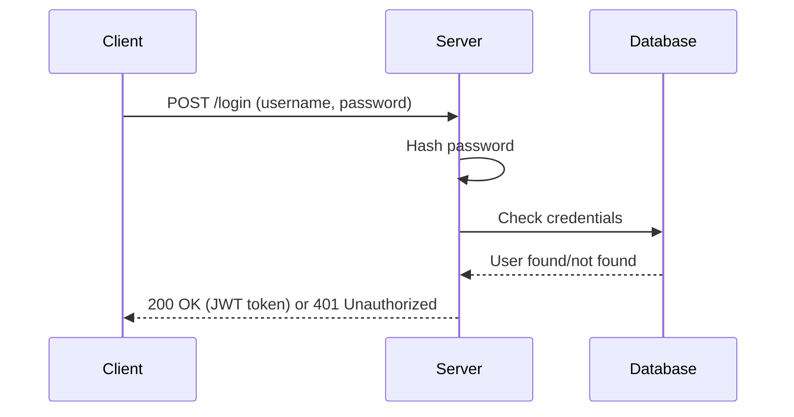

**Testing the API:**

```bash
curl -X POST http://localhost:8000/login \
  -H "Content-Type: application/json" \
  -d '{"username": "admin", "password": "password"}'
```

---

## Challenge 2: Task Queue with Rate Limiting

You need to design a background job queue that prevents overloading your server.

**Goal:** Only allow 5 jobs per minute per user.

```python
from collections import defaultdict
import time
import threading
from typing import Dict, List

class RateLimitedQueue:
    def __init__(self, max_jobs_per_minute: int = 5):
        self.max_jobs = max_jobs_per_minute
        self.user_jobs: Dict[str, List[float]] = defaultdict(list)
        self.lock = threading.Lock()

    def can_enqueue(self, user_id: str) -> bool:
        with self.lock:
            now = time.time()
            # Remove jobs older than 60 seconds
            self.user_jobs[user_id] = [
                t for t in self.user_jobs[user_id]
                if now - t < 60
            ]

            if len(self.user_jobs[user_id]) < self.max_jobs:
                self.user_jobs[user_id].append(now)
                return True
            return False

    def get_user_stats(self, user_id: str) -> Dict:
        now = time.time()
        recent_jobs = [t for t in self.user_jobs[user_id] if now - t < 60]
        return {
            "jobs_this_minute": len(recent_jobs),
            "can_enqueue": len(recent_jobs) < self.max_jobs
        }
```

**Queue Architecture:**

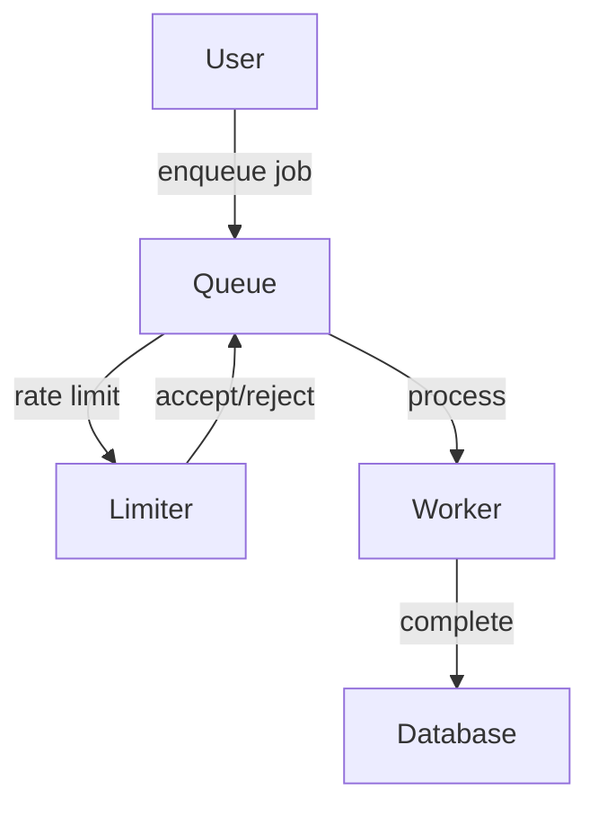

**Usage Example:**

```python
queue = RateLimitedQueue(max_jobs_per_minute=5)

# User tries to enqueue jobs
user_id = "user123"
for i in range(7):
    if queue.can_enqueue(user_id):
        print(f"Job {i+1} enqueued successfully")
    else:
        print(f"Job {i+1} rejected - rate limit exceeded")
```

---

## Challenge 3: Database Connection Pool

Design a robust database connection pool for high-traffic applications.

**Goal:** Efficiently manage database connections with proper error handling.

```python
import psycopg2
from psycopg2 import pool
import threading
import time
from typing import Optional
from contextlib import contextmanager

class DatabasePool:
    def __init__(self, min_connections: int = 5, max_connections: int = 20):
        self.pool = psycopg2.pool.ThreadedConnectionPool(
            min_connections,
            max_connections,
            host="localhost",
            database="myapp",
            user="postgres",
            password="secret"
        )
        self._lock = threading.Lock()
        self._stats = {"connections_created": 0, "connections_used": 0}

    @contextmanager
    def get_connection(self):
        conn = None
        try:
            conn = self.pool.getconn()
            self._stats["connections_used"] += 1
            yield conn
        except Exception as e:
            if conn:
                conn.rollback()
            raise e
        finally:
            if conn:
                self.pool.putconn(conn)

    def execute_query(self, query: str, params: tuple = None) -> list:
        with self.get_connection() as conn:
            with conn.cursor() as cursor:
                cursor.execute(query, params)
                return cursor.fetchall()

    def get_stats(self) -> dict:
        return {
            **self._stats,
            "pool_size": self.pool.get_size(),
            "available_connections": self.pool.get_available()
        }
```

**Connection Pool Flow:**

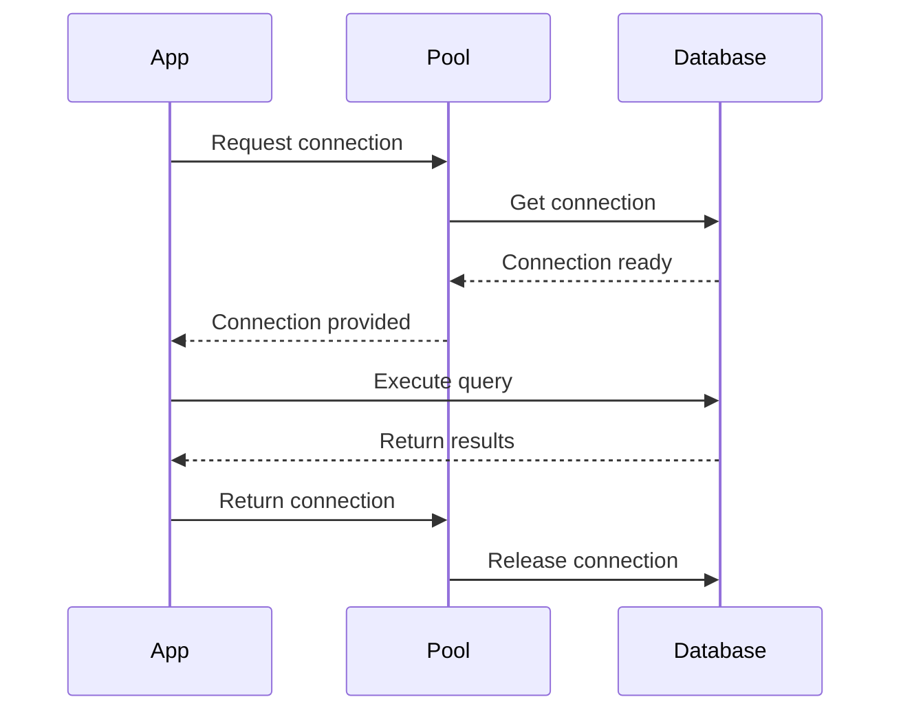

---

## Challenge 4: Caching Layer with TTL

Implement a caching system with time-based expiration.

**Goal:** Reduce database load with intelligent caching.

```python
import redis
import json
import time
from typing import Any, Optional
from functools import wraps

class CacheManager:
    def __init__(self, redis_host: str = "localhost", redis_port: int = 6379):
        self.redis_client = redis.Redis(host=redis_host, port=redis_port, decode_responses=True)
        self.default_ttl = 300  # 5 minutes

    def set(self, key: str, value: Any, ttl: int = None) -> bool:
        try:
            serialized_value = json.dumps(value)
            return self.redis_client.setex(key, ttl or self.default_ttl, serialized_value)
        except Exception as e:
            print(f"Cache set error: {e}")
            return False

    def get(self, key: str) -> Optional[Any]:
        try:
            value = self.redis_client.get(key)
            return json.loads(value) if value else None
        except Exception as e:
            print(f"Cache get error: {e}")
            return None

    def delete(self, key: str) -> bool:
        try:
            return bool(self.redis_client.delete(key))
        except Exception as e:
            print(f"Cache delete error: {e}")
            return False

    def clear_pattern(self, pattern: str) -> int:
        """Delete all keys matching pattern"""
        try:
            keys = self.redis_client.keys(pattern)
            if keys:
                return self.redis_client.delete(*keys)
            return 0
        except Exception as e:
            print(f"Cache clear error: {e}")
            return 0

def cache_result(ttl: int = 300):
    """Decorator to cache function results"""
    def decorator(func):
        @wraps(func)
        def wrapper(*args, **kwargs):
            cache_key = f"{func.__name__}:{hash(str(args) + str(kwargs))}"
            cache_manager = CacheManager()

            # Try to get from cache
            cached_result = cache_manager.get(cache_key)
            if cached_result is not None:
                return cached_result

            # Execute function and cache result
            result = func(*args, **kwargs)
            cache_manager.set(cache_key, result, ttl)
            return result
        return wrapper
    return decorator
```

**Caching Strategy:**

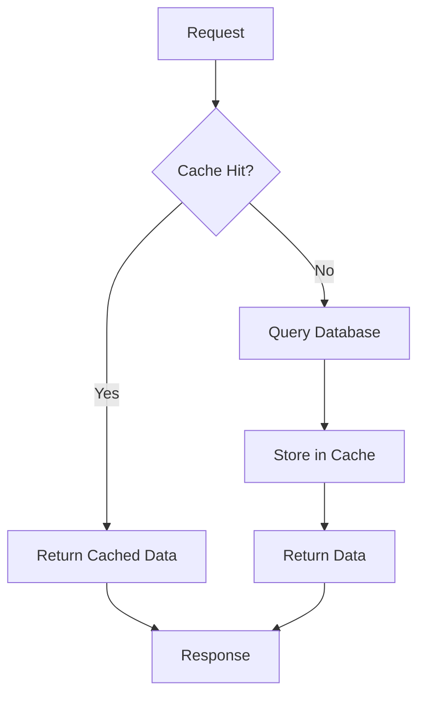

**Usage Example:**

```python
@cache_result(ttl=600)  # Cache for 10 minutes
def get_user_profile(user_id: int) -> dict:
    # Simulate database query
    return {"user_id": user_id, "name": "John Doe", "email": "john@example.com"}

# First call hits database
profile1 = get_user_profile(123)

# Second call hits cache
profile2 = get_user_profile(123)
```

---

## Challenge 5: API Rate Limiting with Redis

Implement sophisticated rate limiting using Redis for distributed systems.

**Goal:** Prevent API abuse with sliding window rate limiting.

```python
import redis
import time
import json
from typing import Tuple
from dataclasses import dataclass

@dataclass
class RateLimitConfig:
    max_requests: int
    window_seconds: int
    burst_allowance: int = 0

class RedisRateLimiter:
    def __init__(self, redis_host: str = "localhost", redis_port: int = 6379):
        self.redis_client = redis.Redis(host=redis_host, port=redis_port, decode_responses=True)

    def is_allowed(self, key: str, config: RateLimitConfig) -> Tuple[bool, dict]:
        now = time.time()
        window_start = now - config.window_seconds

        # Use Redis pipeline for atomic operations
        pipe = self.redis_client.pipeline()

        # Remove old entries
        pipe.zremrangebyscore(key, 0, window_start)

        # Count current requests
        pipe.zcard(key)

        # Add current request
        pipe.zadd(key, {str(now): now})

        # Set expiry on the key
        pipe.expire(key, config.window_seconds)

        results = pipe.execute()
        current_count = results[1]

        # Check if within limits
        is_allowed = current_count <= config.max_requests

        # Calculate remaining requests
        remaining = max(0, config.max_requests - current_count)

        return is_allowed, {
            "limit": config.max_requests,
            "remaining": remaining,
            "reset_time": now + config.window_seconds,
            "current_count": current_count
        }

    def get_user_limits(self, user_id: str) -> dict:
        """Get current rate limit status for a user"""
        key = f"rate_limit:{user_id}"
        config = RateLimitConfig(max_requests=100, window_seconds=3600)  # 100 requests per hour

        is_allowed, stats = self.is_allowed(key, config)
        return {
            "user_id": user_id,
            "allowed": is_allowed,
            **stats
        }
```

**Rate Limiting Flow:**

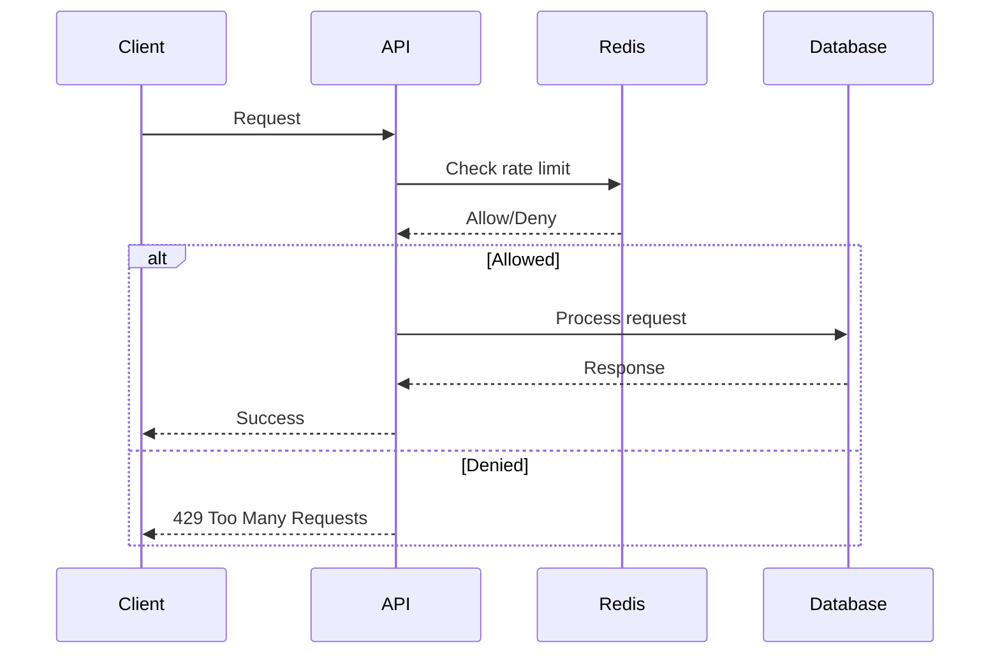

**Middleware Integration:**

```python
from flask import Flask, request, jsonify
from functools import wraps

app = Flask(__name__)
rate_limiter = RedisRateLimiter()

def rate_limit(requests_per_hour: int = 100):
    def decorator(f):
        @wraps(f)
        def decorated_function(*args, **kwargs):
            user_id = request.headers.get('X-User-ID', 'anonymous')
            config = RateLimitConfig(max_requests=requests_per_hour, window_seconds=3600)

            is_allowed, stats = rate_limiter.is_allowed(f"api:{user_id}", config)

            if not is_allowed:
                return jsonify({
                    "error": "Rate limit exceeded",
                    "retry_after": stats["reset_time"]
                }), 429

            response = f(*args, **kwargs)
            response.headers['X-RateLimit-Remaining'] = str(stats["remaining"])
            response.headers['X-RateLimit-Reset'] = str(int(stats["reset_time"]))
            return response
        return decorated_function
    return decorator

@app.route('/api/data')
@rate_limit(requests_per_hour=50)
def get_data():
    return {"data": "Your requested data"}
```

---

## Challenge 6: Message Queue with Dead Letter Queue

Build a robust message processing system with error handling.

**Goal:** Ensure no messages are lost, even when processing fails.

```python
import json
import time
import threading
from typing import Callable, Any, Dict
from dataclasses import dataclass
from enum import Enum
from collections import deque

class MessageStatus(Enum):
    PENDING = "pending"
    PROCESSING = "processing"
    COMPLETED = "completed"
    FAILED = "failed"
    DEAD_LETTER = "dead_letter"

@dataclass
class Message:
    id: str
    data: Any
    status: MessageStatus
    retry_count: int = 0
    max_retries: int = 3
    created_at: float = None
    processed_at: float = None

    def __post_init__(self):
        if self.created_at is None:
            self.created_at = time.time()

class MessageQueue:
    def __init__(self):
        self.main_queue = deque()
        self.dead_letter_queue = deque()
        self.processing_queue = deque()
        self.lock = threading.Lock()
        self.stats = {
            "messages_processed": 0,
            "messages_failed": 0,
            "messages_dead_lettered": 0
        }

    def enqueue(self, data: Any) -> str:
        """Add message to main queue"""
        message_id = f"msg_{int(time.time() * 1000)}"
        message = Message(
            id=message_id,
            data=data,
            status=MessageStatus.PENDING
        )

        with self.lock:
            self.main_queue.append(message)

        return message_id

    def process_messages(self, handler: Callable, batch_size: int = 10):
        """Process messages with error handling"""
        while True:
            batch = []

            # Get batch of messages
            with self.lock:
                for _ in range(min(batch_size, len(self.main_queue))):
                    if self.main_queue:
                        message = self.main_queue.popleft()
                        message.status = MessageStatus.PROCESSING
                        batch.append(message)

            # Process batch
            for message in batch:
                try:
                    result = handler(message.data)
                    message.status = MessageStatus.COMPLETED
                    message.processed_at = time.time()
                    self.stats["messages_processed"] += 1

                except Exception as e:
                    message.retry_count += 1

                    if message.retry_count >= message.max_retries:
                        message.status = MessageStatus.DEAD_LETTER
                        self.dead_letter_queue.append(message)
                        self.stats["messages_dead_lettered"] += 1
                        print(f"Message {message.id} moved to dead letter queue: {e}")
                    else:
                        message.status = MessageStatus.PENDING
                        self.main_queue.append(message)
                        self.stats["messages_failed"] += 1
                        print(f"Message {message.id} failed, retrying ({message.retry_count}/{message.max_retries})")

            time.sleep(0.1)  # Prevent busy waiting

    def get_stats(self) -> Dict:
        with self.lock:
            return {
                **self.stats,
                "main_queue_size": len(self.main_queue),
                "dead_letter_size": len(self.dead_letter_queue),
                "processing_size": len(self.processing_queue)
            }

    def retry_dead_letters(self, handler: Callable):
        """Retry messages from dead letter queue"""
        with self.lock:
            while self.dead_letter_queue:
                message = self.dead_letter_queue.popleft()
                message.status = MessageStatus.PENDING
                message.retry_count = 0
                self.main_queue.append(message)
```

**Message Queue Architecture:**

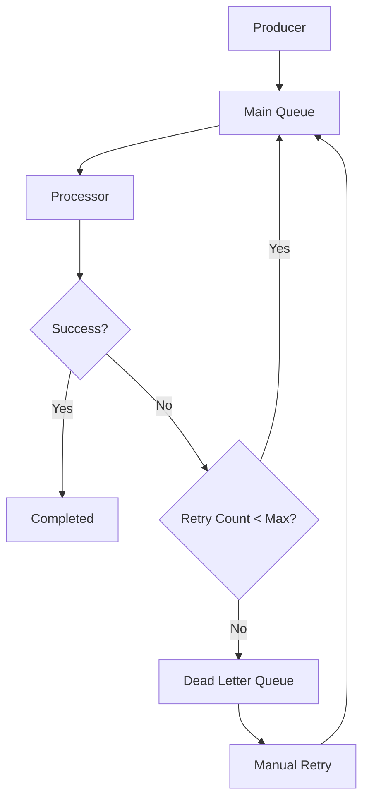

**Usage Example:**

```python
def email_handler(data):
    """Simulate email sending with occasional failures"""
    if "error" in data.get("to", ""):
        raise Exception("Invalid email address")
    print(f"Sending email to {data.get('to')}")
    return True

# Initialize queue
queue = MessageQueue()

# Start processor in background thread
processor_thread = threading.Thread(
    target=queue.process_messages,
    args=(email_handler,),
    daemon=True
)
processor_thread.start()

# Enqueue messages
queue.enqueue({"to": "user@example.com", "subject": "Welcome!"})
queue.enqueue({"to": "error@example.com", "subject": "This will fail"})
queue.enqueue({"to": "admin@example.com", "subject": "Report"})

# Monitor stats
import time
time.sleep(2)
print("Queue Stats:", queue.get_stats())
```

---

## Challenge 7: Database Migration System

Create a version-controlled database migration system.

**Goal:** Safely evolve database schema with rollback capabilities.

```python
import sqlite3
import os
import hashlib
from typing import List, Dict, Optional
from dataclasses import dataclass
from datetime import datetime

@dataclass
class Migration:
    version: int
    name: str
    up_sql: str
    down_sql: str
    checksum: str
    applied_at: Optional[datetime] = None

class MigrationManager:
    def __init__(self, db_path: str):
        self.db_path = db_path
        self.migrations_table = "schema_migrations"
        self._init_migrations_table()

    def _init_migrations_table(self):
        """Create migrations tracking table"""
        with sqlite3.connect(self.db_path) as conn:
            conn.execute(f"""
                CREATE TABLE IF NOT EXISTS {self.migrations_table} (
                    version INTEGER PRIMARY KEY,
                    name TEXT NOT NULL,
                    checksum TEXT NOT NULL,
                    applied_at TIMESTAMP DEFAULT CURRENT_TIMESTAMP
                )
            """)

    def _calculate_checksum(self, content: str) -> str:
        """Calculate SHA256 checksum of migration content"""
        return hashlib.sha256(content.encode()).hexdigest()

    def create_migration(self, name: str, up_sql: str, down_sql: str) -> Migration:
        """Create a new migration"""
        # Get next version number
        with sqlite3.connect(self.db_path) as conn:
            result = conn.execute(f"SELECT MAX(version) FROM {self.migrations_table}")
            max_version = result.fetchone()[0] or 0

        version = max_version + 1
        checksum = self._calculate_checksum(up_sql + down_sql)

        return Migration(
            version=version,
            name=name,
            up_sql=up_sql,
            down_sql=down_sql,
            checksum=checksum
        )

    def apply_migration(self, migration: Migration) -> bool:
        """Apply a migration"""
        try:
            with sqlite3.connect(self.db_path) as conn:
                # Check if already applied
                result = conn.execute(
                    f"SELECT checksum FROM {self.migrations_table} WHERE version = ?",
                    (migration.version,)
                )
                existing = result.fetchone()

                if existing:
                    if existing[0] != migration.checksum:
                        raise Exception(f"Migration {migration.version} checksum mismatch")
                    return True  # Already applied

                # Apply migration
                conn.execute(migration.up_sql)

                # Record migration
                conn.execute(
                    f"INSERT INTO {self.migrations_table} (version, name, checksum) VALUES (?, ?, ?)",
                    (migration.version, migration.name, migration.checksum)
                )

                migration.applied_at = datetime.now()
                return True

        except Exception as e:
            print(f"Failed to apply migration {migration.version}: {e}")
            return False

    def rollback_migration(self, migration: Migration) -> bool:
        """Rollback a migration"""
        try:
            with sqlite3.connect(self.db_path) as conn:
                # Check if migration is applied
                result = conn.execute(
                    f"SELECT checksum FROM {self.migrations_table} WHERE version = ?",
                    (migration.version,)
                )
                if not result.fetchone():
                    return True  # Not applied, nothing to rollback

                # Rollback migration
                conn.execute(migration.down_sql)

                # Remove migration record
                conn.execute(
                    f"DELETE FROM {self.migrations_table} WHERE version = ?",
                    (migration.version,)
                )

                return True

        except Exception as e:
            print(f"Failed to rollback migration {migration.version}: {e}")
            return False

    def get_applied_migrations(self) -> List[Migration]:
        """Get list of applied migrations"""
        with sqlite3.connect(self.db_path) as conn:
            result = conn.execute(
                f"SELECT version, name, checksum, applied_at FROM {self.migrations_table} ORDER BY version"
            )
            return [
                Migration(
                    version=row[0],
                    name=row[1],
                    up_sql="",  # Not stored in DB
                    down_sql="",  # Not stored in DB
                    checksum=row[2],
                    applied_at=datetime.fromisoformat(row[3]) if row[3] else None
                )
                for row in result.fetchall()
            ]
```

**Migration Flow:**

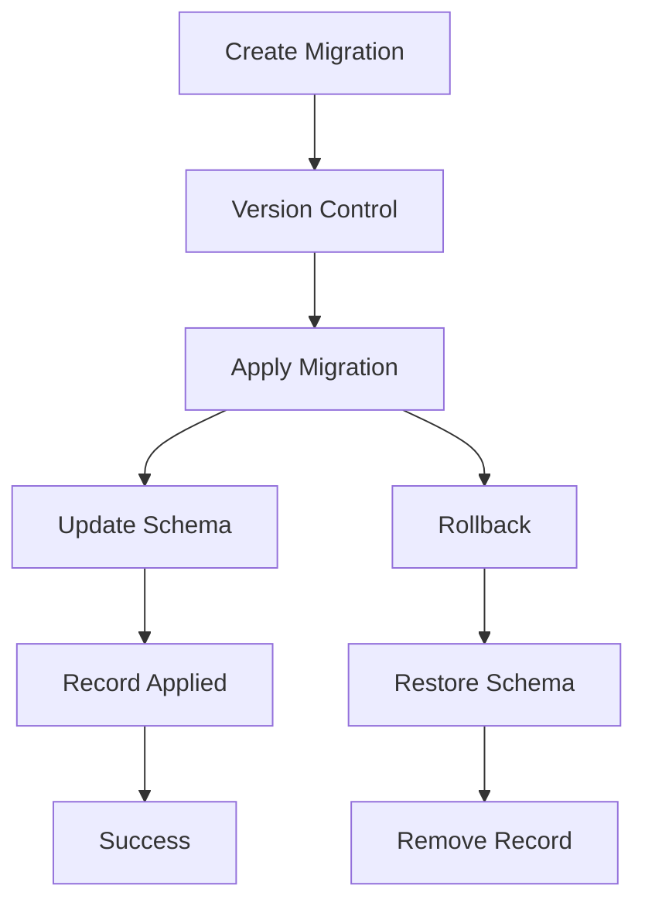

**Usage Example:**

```python
# Initialize migration manager
manager = MigrationManager("app.db")

# Create migrations
migration1 = manager.create_migration(
    name="create_users_table",
    up_sql="""
        CREATE TABLE users (
            id INTEGER PRIMARY KEY,
            username TEXT UNIQUE NOT NULL,
            email TEXT UNIQUE NOT NULL,
            created_at TIMESTAMP DEFAULT CURRENT_TIMESTAMP
        )
    """,
    down_sql="DROP TABLE users"
)

migration2 = manager.create_migration(
    name="add_user_profiles",
    up_sql="""
        CREATE TABLE user_profiles (
            user_id INTEGER PRIMARY KEY,
            bio TEXT,
            avatar_url TEXT,
            FOREIGN KEY (user_id) REFERENCES users(id)
        )
    """,
    down_sql="DROP TABLE user_profiles"
)

# Apply migrations
print("Applying migration 1...")
manager.apply_migration(migration1)

print("Applying migration 2...")
manager.apply_migration(migration2)

# Check applied migrations
applied = manager.get_applied_migrations()
print(f"Applied migrations: {[m.version for m in applied]}")
```

---

## Chapter 1: System Design Principles

<div class="box">
**Key Principles:** Always design for failure, implement proper error handling, and consider scalability from the start. These challenges build upon each other to create robust, production-ready systems.
</div>

**Architecture Patterns:**

<div class="columns">
- **Layered Architecture** - Separate concerns clearly
- **Microservices** - Independent, scalable services
- **Event-Driven** - Loose coupling through events
- **CQRS** - Separate read and write operations
</div>

**System Design Flow:**

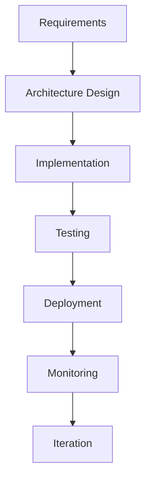

---

## Chapter 2: Performance Optimization

<div class="box">
**Performance Tip:** Always measure before optimizing. Use profiling tools to identify bottlenecks, then apply targeted optimizations.
</div>

**Optimization Strategies:**

<div class="columns">
- **Caching** - Reduce database load
- **Connection Pooling** - Reuse connections
- **Async Processing** - Non-blocking operations
- **Database Indexing** - Faster queries
</div>

**Performance Monitoring:**

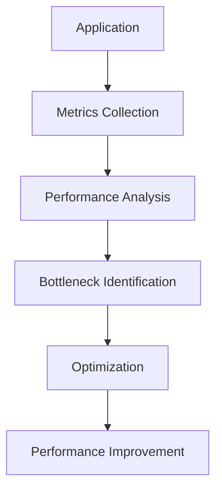

---

## Final Challenge: Complete System Integration

<div class="box">
**Your Mission:** Combine all the components you've built into a complete, production-ready backend system. This is where everything comes together!
</div>

**System Components:**

<div class="columns">
- Authentication API with JWT tokens
- Rate-limited task queue
- Database connection pooling
- Redis caching layer
- Message queue with dead letter handling
- Database migration system
</div>

**Complete System Architecture:**

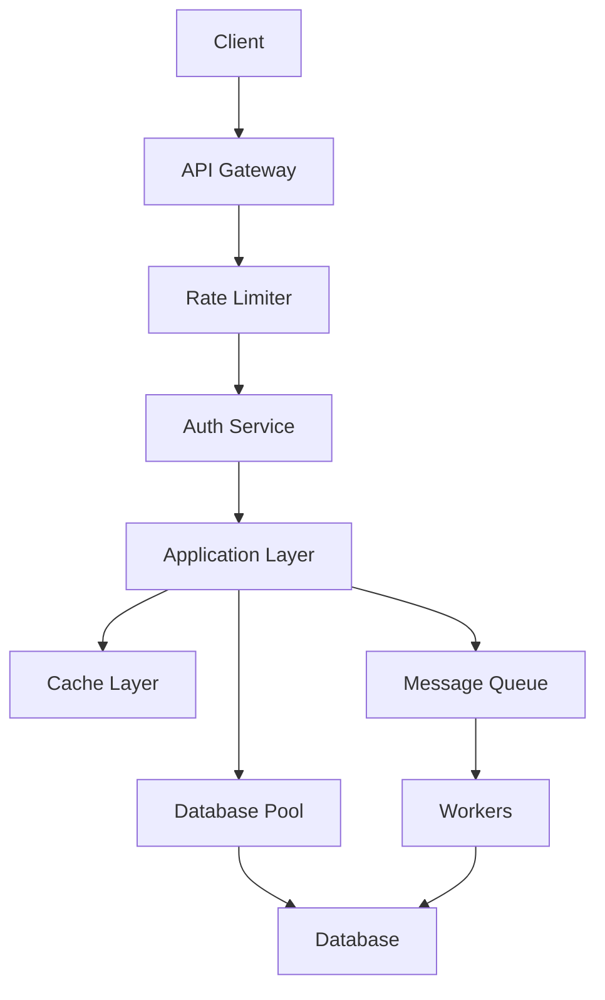

**Integration Checklist:**

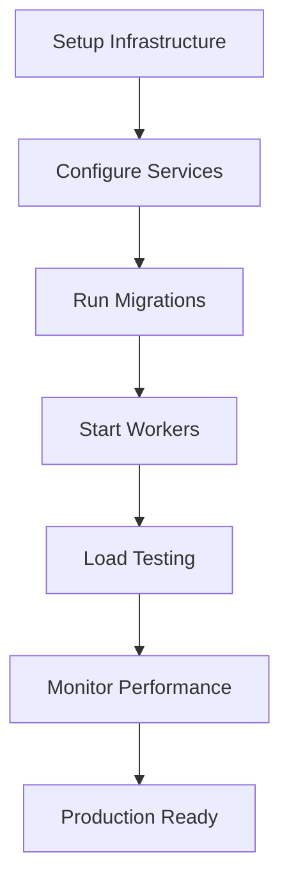

---

## Congratulations!

<div class="box">
You've completed the comprehensive backend challenges! You now have the skills to build robust, scalable backend systems that can handle real-world production loads. Remember to always consider security, performance, and maintainability in your designs.
</div>

**Next Steps:**

<div class="columns">
- Implement monitoring and alerting
- Add comprehensive logging
- Set up CI/CD pipelines
- Learn about containerization and orchestration
- Explore cloud-native architectures
</div>

> "The best code is no code at all." — Jeff Atwood
