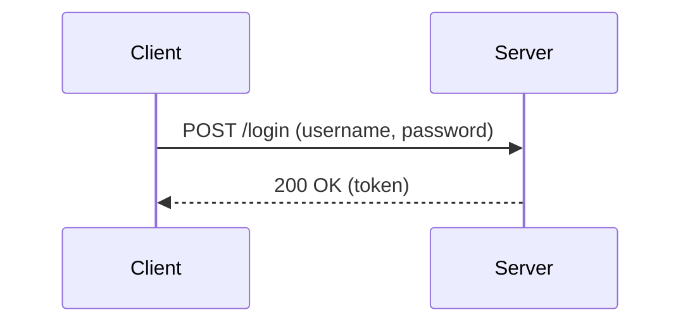
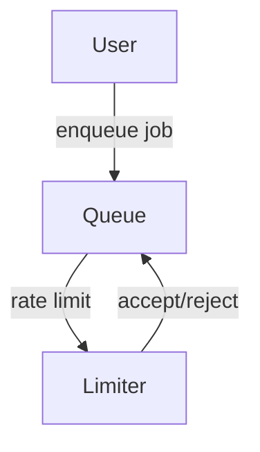

# Backend Challenges: Level Up

> "Code is like humor. When you have to explain it, it's bad." — Cory House

<div class="box">
Welcome to the backend coding challenge series! Each lesson is designed to help you master real-world backend skills with clarity and elegance.
</div>

## Challenge 1: User Authentication API

Imagine you are building a modern web app. Your first task is to create a simple authentication API.

**Goal:** Accept a username and password, and return a token if valid.

```python
def authenticate(username, password):
    if username == "admin" and password == "secret":
        return "token_12345"
    return None
```

**Flow:**



---

## Challenge 2: Task Queue with Rate Limiting

You need to design a background job queue that prevents overloading your server.

**Goal:** Only allow 5 jobs per minute per user.

```python
from collections import defaultdict
import time

user_jobs = defaultdict(list)

def can_enqueue(user_id):
    now = time.time()
    # Remove jobs older than 60 seconds
    user_jobs[user_id] = [t for t in user_jobs[user_id] if now - t < 60]
    if len(user_jobs[user_id]) < 5:
        user_jobs[user_id].append(now)
        return True
    return False
```

**Flow:**


