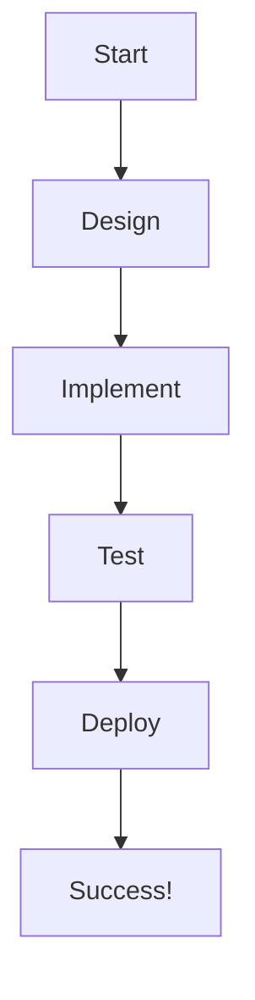
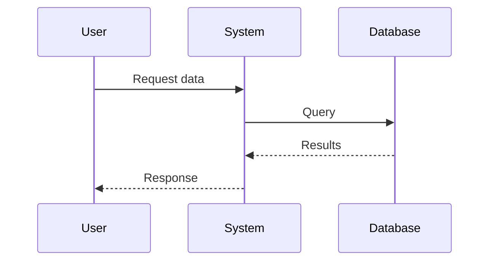
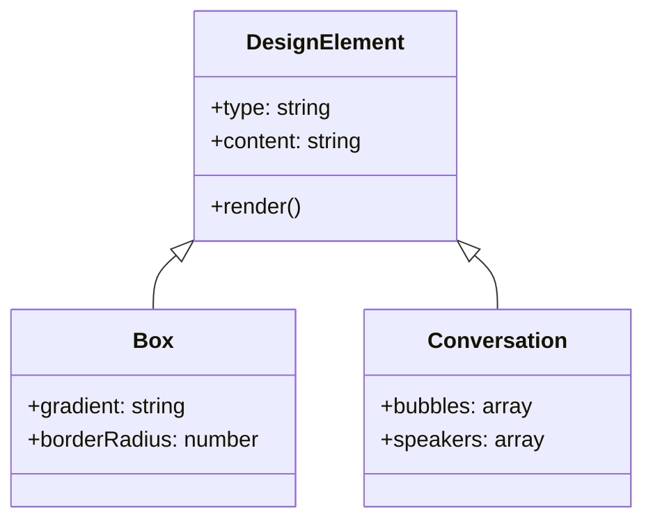

# Design Elements Showcase

> "Good design is obvious. Great design is transparent." — Joe Sparano

## 🎨 Box Elements

<div class="box">
This is a **box element** with gradient background and elegant styling. Perfect for highlighting important information, tips, or key concepts. The box has a warm gradient background with subtle shadows and rounded corners.
</div>

<div class="box">
**Pro Tip:** Boxes are great for:
- Highlighting important information
- Creating visual breaks in content
- Emphasizing key concepts
- Adding visual interest to your content
</div>

## 📊 Multi-Column Layouts

<div class="columns">
- **Feature 1:** Elegant multi-column layout
- **Feature 2:** Responsive design that adapts to screen size
- **Feature 3:** Perfect for comparing items or listing features
- **Feature 4:** Clean and organized presentation
</div>

<div class="columns">
**Left Column Content**
This column can contain any type of content including paragraphs, lists, or even nested elements.

**Right Column Content**
The columns automatically balance and adapt to different screen sizes for optimal reading experience.

</div>

## 💬 Conversation Elements

<div class="conversation">
> **You:** "Hello! How are you today?"

> **Friend:** "I'm doing great, thanks! How about you?"

> **You:** "I'm wonderful! Would you like to grab coffee?"

> **Friend:** "That sounds perfect! When works for you?"

</div>

<div class="conversation">
> **Teacher:** "What did you learn today?"

> **Student:** "I learned about conversation design!"

> **Teacher:** "Excellent! Can you explain it?"

> **Student:** "It uses elegant chat bubbles with gradients and proper spacing."

</div>

## 📝 Blockquotes

> This is a **standard blockquote** with elegant styling. It has a left border, background color, and italic text. Perfect for highlighting quotes, important notes, or emphasizing key information.

> **Another blockquote** with different content to show how they look in sequence. Each blockquote is properly spaced and styled for optimal readability.

## 🔤 Typography Examples

### Headings

# H1 Heading - Main Title

## H2 Heading - Section Title

### H3 Heading - Subsection Title

### Text Styling

**Bold text** for emphasis and _italic text_ for subtle emphasis. You can also use `inline code` for technical terms.

### Lists

- **Unordered list** with bullet points
- **Another item** with different content
- **Third item** to show spacing

1. **Ordered list** with numbers
2. **Second item** in sequence
3. **Third item** for completeness

## 🎯 Code Blocks

```python
def showcase_design():
    """This function demonstrates code block styling"""
    print("Code blocks have syntax highlighting")
    print("They're perfect for programming examples")
    return "Elegant and readable"
```

```bash
# Terminal commands
echo "Command line examples"
python3 run_script.py
git commit -m "Update design showcase"
```

## 📈 Mermaid Diagrams

### Flow Chart



### Sequence Diagram



### Class Diagram



## 🎨 Color Palette

<div class="columns">
**Primary Colors:**
- Blue: #2a6f97 (Headings)
- Purple: #6366f1 (Accents)
- Green: #10b981 (Success)
- Orange: #f59e0b (Warnings)

**Background Colors:**

- Light: #f8fafd
- White: #ffffff
- Gray: #f1f5f9
</div>

## 📱 Responsive Design

<div class="box">
**Responsive Features:**
- Adapts to desktop, tablet, and mobile screens
- Optimized typography for each device
- Flexible layouts that maintain readability
- Touch-friendly interactions on mobile
</div>

## 🎯 Interactive Elements

<div class="conversation">
> **System:** "Hover over the chat bubbles to see animations!"

> **User:** "Wow, they lift up and scale slightly!"

> **System:** "Exactly! Smooth transitions make the interface feel premium."

> **User:** "The gradients and shadows look amazing!"

</div>

## 📋 Summary

<div class="columns">
**Design Elements Available:**
- Boxes with gradients
- Multi-column layouts
- Conversation bubbles
- Blockquotes
- Code blocks
- Mermaid diagrams
- Responsive design
- Interactive animations

**Best Practices:**

- Use boxes for important info
- Columns for comparisons
- Conversations for dialogue
- Diagrams for visual learning
</div>

---

## 🎉 Conclusion

<div class="box">
This showcase demonstrates all the elegant design elements available in your ebook templates. Each element is carefully crafted to provide a premium reading experience that's both beautiful and functional.
</div>

> "Design is not just what it looks like and feels like. Design is how it works." — Steve Jobs
