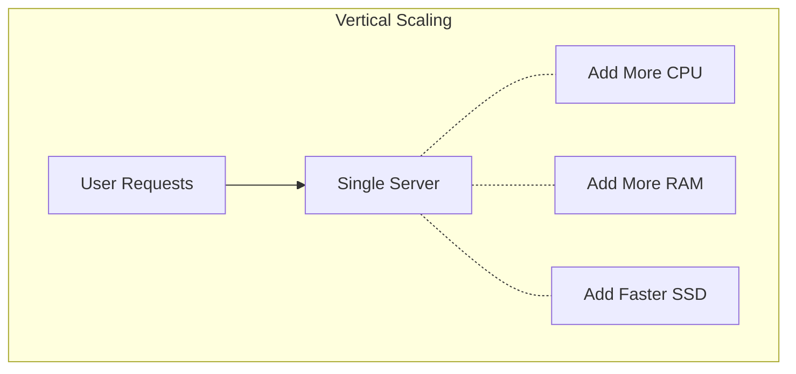
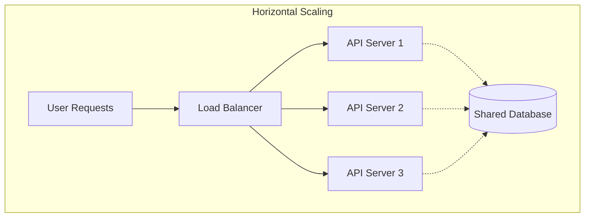
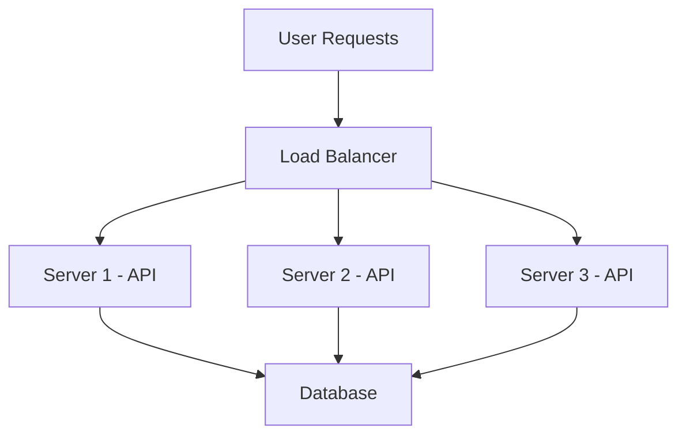
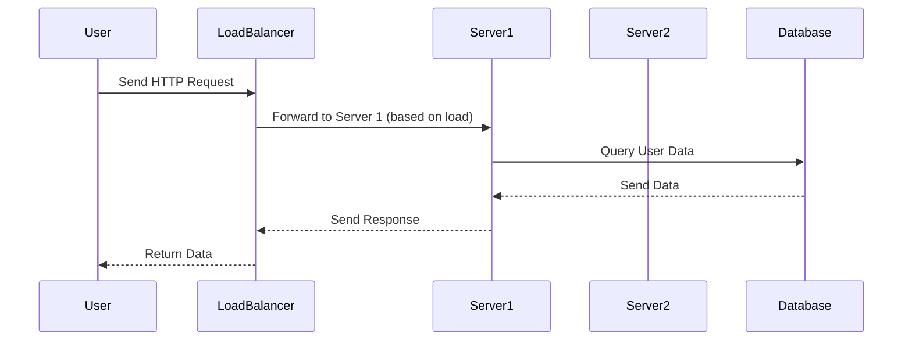
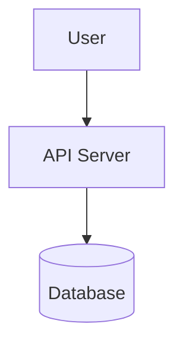
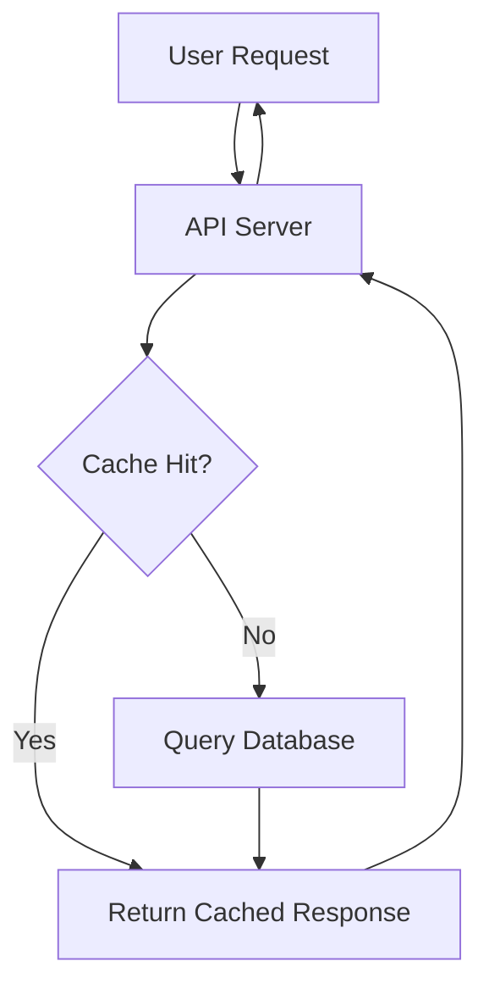
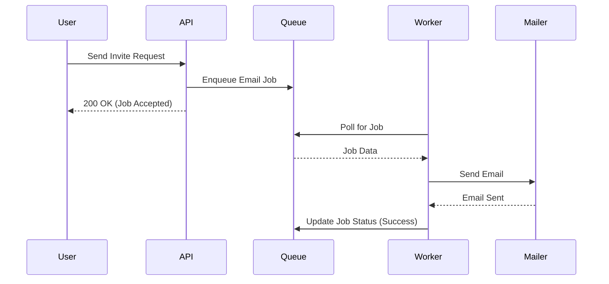
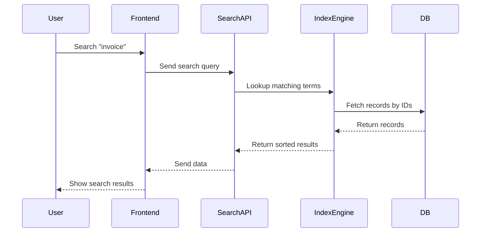

# Know the Why Behind Backend Engineering?

> “The hardest single part of building a software system is deciding precisely what to build.” — Fred Brooks

A simple novel with a happy ending in every chapter — revealing the "why" behind backend engineering.

## Why Do You Even Need a Backend?

The app looked complete. It had a clean React frontend, a public Airtable sheet, and a few Zapier automations.

It worked fine — until real users started using it.

Customer support wanted to check what a user did.
The product team needed to lock some features after 14 days.
The legal team asked if the data could stay inside the EU.
Marketing wanted to launch a referral program.

The founder agreed to everything.
But the Airtable setup couldn’t handle it.

Some data went missing.
Zapier reached its free usage limit.
Users found ways to cheat the login system.
No one could track who changed what, or when.

That’s when it became clear — the app needed a backend.
Not for scale.
But to stay alive.

A small server, a real database, and a few secure routes were enough to take control.

The app could now store data properly, manage user permissions, and grow without breaking.

The frontend still looked the same. But now, the logic was safe on the backend.

A backend is not just about APIs or fancy tools.
It gives your app memory, structure, and rules.

That’s the moment it turns from a simple demo into a real product.

## Why Can’t You Just Keep Upgrading the Same Server?

When you launch a new app, one server feels perfect.
It handles everything — the API, the database, the frontend, even background tasks.

So when traffic grows, it’s natural to think: just upgrade the server.

- More RAM.
- Faster CPU.
- Bigger storage.

It works — for a while.

But as load increases, the server starts to slow down.
CPU hits 100%. Memory fills up. Disk writes get slower.
Everything shares the same machine, so one bottleneck affects the entire app.

And then — it crashes.

Now every part of your app is offline.
One server means one point of failure. No backups. No fallbacks.

Even if you buy the best machine possible, there’s a hard ceiling.
No cloud provider can sell you "infinite RAM" or a CPU that scales forever.
You also can’t move parts of your app closer to users around the world — it’s stuck in one place.

That’s why backend systems don’t just go “bigger.”
They go **wider** — with multiple servers doing different jobs.

You split things:
- One server for the database.
- One for the API.
- One for background processing.
- A load balancer in front.

That’s the start of horizontal scaling.
It’s more complex, but it keeps your app alive when things grow.

Vertical scaling works at the beginning.
But real systems outgrow it fast.

### Vertical Scaling (Scale Up)

### Horizontal Scaling (Scale Out)

## Why Do You Need a Load Balancer?

You launched your app.
It grew. Users started signing up — not just from your city, but from around the world.

You added a second server.
Then a third.

But now… weird things start happening.

Some users stay logged in. Others get randomly logged out.
Uploads fail occasionally.
And when one server crashes, users get errors — even though the other servers are fine.

What’s going on?

Each server is doing its job.
But there’s no one coordinating them.
No one standing at the gate, deciding which user should talk to which server.

That’s what a load balancer does.

It sits in front of your servers and plays traffic cop.
Each user request goes through it — and it decides which server should respond.
It can send requests evenly, or based on health checks, or even region.

Suddenly, your app becomes stable again.

- Sessions stay consistent.
- Traffic is balanced across machines.
- If one server goes down, the load balancer skips it automatically.

Your servers stop competing. They start collaborating.

Adding a second server isn't enough.
You also need a brain in front — and that’s the load balancer.

An example of request routing via load balancer:

## Why Do You Even Need a Database?

In the beginning, the app didn’t need much. User data was stored in memory, some lists were saved in a local JSON file, and messages were just written to a text log.

It worked — until the server restarted.

One deploy, one crash, one power cut — and everything was gone. No users, no settings, no records. Like it never existed in the first place.

That’s when you realized it wasn’t just about storing data. You needed memory that survives restarts. A system that could read and write data reliably, even when things go wrong.

So you picked a database. Maybe PostgreSQL. Maybe MongoDB.

Now the data stayed — even after crashes. Users could log in again. Their preferences were still there. Orders didn’t vanish. Chats didn’t reset.

It finally started feeling like a real app.

The frontend still looked the same. But now it had a solid memory behind it — a place that remembers what happened.

Every feature now touched the database. The API read from it. Wrote to it. Queried it. The app slowly became a real system — one with a proper backend, not just a UI.

A database doesn’t just store things. It gives your app memory. And memory is what makes people trust what they use.

## Why Do You Need Caching?

Every time someone opens your app, they expect it to be fast. Not “just okay” fast — instant.

But your backend has work to do. It talks to the database. It processes logic. It formats responses. That takes time.

Now imagine thousands of users doing the same thing. All asking for the same product list. Or the same homepage. Or the same news feed.

Do you really want your server to run the same logic over and over again?

That’s where caching comes in.

Instead of building the response from scratch each time, you store it once and reuse it. Like saving the answer to a test — so you don’t have to solve the same question again.

For example:

- A product page doesn’t change often.
- A homepage layout stays the same for hours.
- An API response might be valid for a few minutes.

Why waste server power on generating the same thing repeatedly?

With caching, your server becomes smarter.
It checks:
“Have I already seen this request before?”
“Yes?” — then reply instantly.
“No?” — process it once, cache it, and serve faster next time.

There are many places to cache:

- **Browser cache** — the user’s device stores assets.
- **CDN cache** — images and static pages get served from locations near the user.
- **Application cache** — frequently requested API data is stored in memory (like Redis).

Each layer cuts down the work your backend has to do.

But caching isn't magic.
You have to decide:

- What to cache?
- For how long?
- How to refresh or invalidate it?

If you get it right, caching makes your system feel faster than it really is.
Even small apps with simple caches feel smooth.
Big systems simply can’t survive without it.

Because if you're building things that don’t change often...
You might as well build them just once — and cache the rest.

## Why Do You Need Asynchronous Processing?

In the beginning, your app responded instantly. Users clicked a button, and the result appeared almost immediately.

Then features started piling up. You added email invites. Someone requested PDF exports. Users wanted to upload large files, and marketing needed weekly reports. One by one, these tasks made each request slower.

Suddenly, users were waiting several seconds just to get a response. Sending an email blocked the whole app. Generating a report froze the interface for everyone.

So you upgraded the server — more RAM, faster CPU. But the problem stayed. Because the real issue wasn’t the power of the machine. It was the idea that **everything had to happen right away**.

Think about a coffee shop. When you order a latte, the barista doesn’t make it on the spot and block the whole queue. They take your order, print a ticket, and move on. When your drink is ready, they call your name.

That’s exactly what asynchronous processing does in your backend.

Instead of doing all the work inside the same request, you hand it off to a background job. The user gets a quick “All set!” and continues using the app. Meanwhile, a worker takes care of the real task — sending the email, resizing the image, generating the report — without slowing anyone down.

It’s not just about speed. Async processing adds reliability. If something fails, you can retry. If traffic spikes, you can scale your workers separately. Your main app stays smooth, responsive, and under control.

When things grow, not everything needs to happen now. That’s the key to building calm, resilient systems.

### An Example of Asynchronous Processing with Background Jobs

A user sends an invite request, the API enqueues the job, and the worker sends the email in the background.

## Why Do You Need Search or Indexing?

You built a simple app.
Users could create items, view them, and maybe even edit them. That was enough—until someone asked, “Can I search for all items with the word *invoice* in the title?”

You wrote a loop that checked each item in the database. It worked. For ten users.

Then came a hundred. Then a thousand. Now each search was taking five seconds… sometimes more.

You tried writing SQL like `WHERE title LIKE '%invoice%'`.
Still slow.
Because databases aren’t built for guessing or fuzzy finding. They’re built for exact retrieval.

That’s when indexing becomes essential.

Think of it like a book. If you want to find something in a 500-page manual without an index, you’d flip through every page. But with an index, you just jump to the right section instantly.

Search engines like Elasticsearch, Meilisearch, and Typesense do exactly that. They create an optimized lookup structure — an index — that helps you find matching results quickly, even if there are typos or filters.

Instead of checking every row, the search engine jumps directly to matching entries. That’s the difference between waiting 3 seconds and getting results in 30 milliseconds.

In modern apps, search is not an extra feature.
It’s expected.

If users can’t find something, they assume it doesn’t exist.
If they can search instantly, they feel like the app just *gets them*.

That’s why smart backends add indexing early.
Because slow search doesn’t just frustrate people — it quietly kills growth.

### How Indexed Search Works

